| ID         | Name             | Icon                             |
| ---------- | ---------------- | -------------------------------- |
| 00000001   | 00000001NAME     |        |
| 10000000   | 10000000NAME     |        |
| 10000010   | 10000010NAME     |        |
| 10000011   | 10000011NAME     |        |
| 10000012   | 10000012NAME     |        |
| 10000013   | 10000013NAME     |        |
| 10000020   | 10000020NAME     |        |
| 10000021   | 10000021NAME     |        |
| 10000022   | 10000022NAME     |        |
| 10000030   | 10000030NAME     |        |
| 10000031   | 10000031NAME     |        |
| 10000032   | 10000032NAME     |        |
| 10000033   | 10000033NAME     |        |
| 10000034   | 10000034NAME     |        |
| 10000040   | 10000040NAME     |        |
| 10000050   | 10000050NAME     |        |
| 10000060   | 10000060NAME     |        |
| 10000061   | 10000061NAME     |        |
| 10000062   | 10000062NAME     |        |
| 10000063   | 10000063NAME     |        |
| 10000064   | 10000064NAME     |        |
| 10000070   | 10000070NAME     |        |
| 10000071   | 10000071NAME     |        |
| 10000072   | 10000072NAME     |        |
| 10000080   | 10000080NAME     | 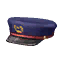       |
| 10000090   | 10000090NAME     |        |
| 10000091   | 10000091NAME     |        |
| 10000100   | 10000100NAME     |        |
| 10000101   | 10000101NAME     |        |
| 10000102   | 10000102NAME     |        |
| 10000110   | 10000110NAME     |        |
| 10000111   | 10000111NAME     |        |
| 10000112   | 10000112NAME     |        |
| 10000120   | 10000120NAME     |        |
| 10000121   | 10000121NAME     |        |
| 10000130   | 10000130NAME     |        |
| 10000140   | 10000140NAME     |        |
| 10000150   | 10000150NAME     |        |
| 10000160   | 10000160NAME     |        |
| 10000170   | 10000170NAME     |        |
| 10000180   | 10000180NAME     |        |
| 10000181   | 10000181NAME     |        |
| 10000190   | 10000190NAME     |        |
| 10000200   | 10000200NAME     |        |
| 10000210   | 10000210NAME     |        |
| 10000220   | 10000220NAME     |        |
| 10000221   | 10000221NAME     |        |
| 10000230   | 10000230NAME     |        |
| 10000240   | 10000240NAME     |        |
| 10000250   | 10000250NAME     |        |
| 10000260   | 10000260NAME     |        |
| 10000261   | 10000261NAME     |        |
| 10000270   | 10000270NAME     |        |
| 10000280   | 10000280NAME     |        |
| 10100000   | 10100000NAME     |        |
| 10100010   | 10100010NAME     |        |
| 10100011   | 10100011NAME     |        |
| 10100012   | 10100012NAME     |        |
| 10100020   | 10100020NAME     |        |
| 10100030   | 10100030NAME     |        |
| 10100031   | 10100031NAME     |        |
| 10100032   | 10100032NAME     |        |
| 10100033   | 10100033NAME     |        |
| 10100034   | 10100034NAME     |        |
| 10100035   | 10100035NAME     | 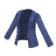       |
| 10100036   | 10100036NAME     |        |
| 10100050   | 10100050NAME     |        |
| 10100051   | 10100051NAME     |        |
| 10100052   | 10100052NAME     |        |
| 10100053   | 10100053NAME     |        |
| 10100054   | 10100054NAME     |        |
| 10100060   | 10100060NAME     |        |
| 10100061   | 10100061NAME     |        |
| 10100062   | 10100062NAME     |        |
| 10100063   | 10100063NAME     |        |
| 10100064   | 10100064NAME     |        |
| 10100065   | 10100065NAME     |        |
| 10100066   | 10100066NAME     |        |
| 10100070   | 10100070NAME     |        |
| 10100071   | 10100071NAME     |        |
| 10100072   | 10100072NAME     |        |
| 10100073   | 10100073NAME     |        |
| 10100080   | 10100080NAME     |        |
| 10100081   | 10100081NAME     |        |
| 10100082   | 10100082NAME     |        |
| 10100083   | 10100083NAME     |        |
| 10100090   | 10100090NAME     |        |
| 10100091   | 10100091NAME     |        |
| 10100092   | 10100092NAME     |        |
| 10100093   | 10100093NAME     |        |
| 10100094   | 10100094NAME     |        |
| 10100100   | 10100100NAME     |        |
| 10100101   | 10100101NAME     |        |
| 10100102   | 10100102NAME     |        |
| 10100110   | 10100110NAME     |        |
| 10100111   | 10100111NAME     |        |
| 10100112   | 10100112NAME     |        |
| 10100113   | 10100113NAME     |        |
| 10100114   | 10100114NAME     |        |
| 10100115   | 10100115NAME     |        |
| 10100120   | 10100120NAME     |        |
| 10100121   | 10100121NAME     |        |
| 10100122   | 10100122NAME     |        |
| 10100123   | 10100123NAME     |        |
| 10100130   | 10100130NAME     |        |
| 10100131   | 10100131NAME     |        |
| 10100132   | 10100132NAME     |        |
| 10100135   | 10100135NAME     |        |
| 10100136   | 10100136NAME     |        |
| 10100137   | 10100137NAME     |        |
| 10100138   | 10100138NAME     |        |
| 10100139   | 10100139NAME     |        |
| 10100140   | 10100140NAME     |        |
| 10100141   | 10100141NAME     |        |
| 10100142   | 10100142NAME     |        |
| 10100143   | 10100143NAME     |        |
| 10100144   | 10100144NAME     |        |
| 10100160   | 10100160NAME     |        |
| 10100161   | 10100161NAME     |        |
| 10100162   | 10100162NAME     |        |
| 10100170   | 10100170NAME     |        |
| 10100171   | 10100171NAME     |        |
| 10100172   | 10100172NAME     |        |
| 10100173   | 10100173NAME     |        |
| 10100174   | 10100174NAME     |        |
| 10100175   | 10100175NAME     |        |
| 10100180   | 10100180NAME     |        |
| 10100190   | 10100190NAME     |        |
| 10100191   | 10100191NAME     |        |
| 10100192   | 10100192NAME     |        |
| 10100200   | 10100200NAME     |        |
| 10100201   | 10100201NAME     |        |
| 10100202   | 10100202NAME     |        |
| 10100203   | 10100203NAME     |        |
| 10100210   | 10100210NAME     |        |
| 10100211   | 10100211NAME     |        |
| 10100212   | 10100212NAME     |        |
| 10100220   | 10100220NAME     |        |
| 10100221   | 10100221NAME     |        |
| 10100222   | 10100222NAME     |        |
| 10100223   | 10100223NAME     |        |
| 10100224   | 10100224NAME     |        |
| 10100225   | 10100225NAME     |        |
| 10100226   | 10100226NAME     |        |
| 10100250   | 10100250NAME     |        |
| 10100251   | 10100251NAME     |        |
| 10100252   | 10100252NAME     | 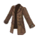       |
| 10100260   | 10100260NAME     |        |
| 10100270   | 10100270NAME     |        |
| 10100280   | 10100280NAME     |        |
| 10100281   | 10100281NAME     |        |
| 10100282   | 10100282NAME     |        |
| 10100300   | 10100300NAME     |        |
| 10100310   | 10100310NAME     |        |
| 10100320   | 10100320NAME     |        |
| 10100340   | 10100340NAME     |        |
| 10100341   | 10100341NAME     |        |
| 10100342   | 10100342NAME     |        |
| 10100370   | 10100370NAME     |        |
| 10100380   | 10100380NAME     |        |
| 10100381   | 10100381NAME     |        |
| 10100385   | 10100385NAME     |        |
| 10100386   | 10100386NAME     |        |
| 10100390   | 10100390NAME     |        |
| 10100391   | 10100391NAME     |        |
| 10100392   | 10100392NAME     |        |
| 10100393   | 10100393NAME     |        |
| 10100394   | 10100394NAME     |        |
| 10100395   | 10100395NAME     |        |
| 10100400   | 10100400NAME     |        |
| 10100410   | 10100410NAME     |        |
| 10100411   | 10100411NAME     |        |
| 10100412   | 10100412NAME     |        |
| 10100420   | 10100420NAME     |        |
| 10100421   | 10100421NAME     |        |
| 10100422   | 10100422NAME     |        |
| 10100423   | 10100423NAME     |        |
| 10100424   | 10100424NAME     |        |
| 10100425   | 10100425NAME     |        |
| 10100430   | 10100430NAME     |        |
| 10100440   | 10100440NAME     |        |
| 10100450   | 10100450NAME     |        |
| 10100451   | 10100451NAME     |        |
| 10100452   | 10100452NAME     |        |
| 10100460   | 10100460NAME     |        |
| 10100461   | 10100461NAME     |        |
| 10100470   | 10100470NAME     |        |
| 10100480   | 10100480NAME     |        |
| 10100481   | 10100481NAME     |        |
| 10100482   | 10100482NAME     |        |
| 10100483   | 10100483NAME     |        |
| 10100500   | 10100500NAME     |        |
| 10100501   | 10100501NAME     |        |
| 10100503   | 10100503NAME     |        |
| 10100510   | 10100510NAME     |        |
| 10100520   | 10100520NAME     |        |
| 10100530   | 10100530NAME     |        |
| 10100531   | 10100531NAME     |        |
| 10100532   | 10100532NAME     |        |
| 10100540   | 10100540NAME     |        |
| 10100541   | 10100541NAME     |        |
| 10100550   | 10100550NAME     |        |
| 10100551   | 10100551NAME     |        |
| 10100570   | 10100570NAME     |        |
| 10100571   | 10100571NAME     |        |
| 10100580   | 10100580NAME     |        |
| 10100581   | 10100581NAME     |        |
| 10100582   | 10100582NAME     |        |
| 10100590   | 10100590NAME     |        |
| 10100591   | 10100591NAME     |        |
| 10100592   | 10100592NAME     |        |
| 10100600   | 10100600NAME     |        |
| 10100601   | 10100601NAME     |        |
| 10100602   | 10100602NAME     |        |
| 10100610   | 10100610NAME     |        |
| 10100611   | 10100611NAME     |        |
| 10100620   | 10100620NAME     |        |
| 10100621   | 10100621NAME     |        |
| 10100622   | 10100622NAME     |        |
| 10100623   | 10100623NAME     |        |
| 10100630   | 10100630NAME     |        |
| 10100631   | 10100631NAME     |        |
| 10100632   | 10100632NAME     |        |
| 10100633   | 10100633NAME     |        |
| 10100640   | 10100640NAME     |        |
| 10100641   | 10100641NAME     |        |
| 10100643   | 10100643NAME     |        |
| 10100650   | 10100650NAME     |        |
| 10100651   | 10100651NAME     |        |
| 10100660   | 10100660NAME     |        |
| 10100661   | 10100661NAME     |        |
| 10100670   | 10100670NAME     |        |
| 10100671   | 10100671NAME     |        |
| 10100672   | 10100672NAME     |        |
| 10100680   | 10100680NAME     | 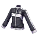       |
| 10100681   | 10100681NAME     |        |
| 10100682   | 10100682NAME     |        |
| 10100683   | 10100683NAME     |        |
| 10100684   | 10100684NAME     |        |
| 10100690   | 10100690NAME     |        |
| 10100691   | 10100691NAME     |        |
| 10100692   | 10100692NAME     |        |
| 10100693   | 10100693NAME     |        |
| 10100694   | 10100694NAME     |        |
| 10100700   | 10100700NAME     | 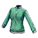       |
| 10100710   | 10100710NAME     |        |
| 10100720   | 10100720NAME     |        |
| 10100721   | 10100721NAME     |        |
| 10100730   | 10100730NAME     |        |
| 10100740   | 10100740NAME     |        |
| 10100741   | 10100741NAME     |        |
| 10100750   | 10100750NAME     |        |
| 10100760   | 10100760NAME     |        |
| 10100761   | 10100761NAME     |        |
| 10100762   | 10100762NAME     |        |
| 10100770   | 10100770NAME     |        |
| 10100771   | 10100771NAME     |        |
| 10100780   | 10100780NAME     |        |
| 10100800   | 10100800NAME     |        |
| 10100810   | 10100810NAME     |        |
| 10100820   | 10100820NAME     |        |
| 10100830   | 10100830NAME     |        |
| 10100840   | 10100840NAME     |        |
| 10100850   | 10100850NAME     |        |
| 10100860   | 10100860NAME     |        |
| 10100861   | 10100861NAME     |        |
| 10100862   | 10100862NAME     |        |
| 10100880   | 10100880NAME     |        |
| 10100881   | 10100881NAME     |        |
| 10100890   | 10100890NAME     |        |
| 10100891   | 10100891NAME     |        |
| 10100900   | 10100900NAME     |        |
| 10100910   | 10100910NAME     |        |
| 10100920   | 10100920NAME     |        |
| 10100921   | 10100921NAME     |        |
| 10100922   | 10100922NAME     |        |
| 10100930   | 10100930NAME     |        |
| 10100940   | 10100940NAME     |        |
| 10100941   | 10100941NAME     |        |
| 10100950   | 10100950NAME     |        |
| 10100951   | 10100951NAME     | 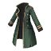       |
| 10100960   | 10100960NAME     |        |
| 10100961   | 10100961NAME     |        |
| 10100962   | 10100962NAME     |        |
| 10100970   | 10100970NAME     |        |
| 10100990   | 10100990NAME     |        |
| 10101010   | 10101010NAME     |        |
| 10101011   | 10101011NAME     |        |
| 10101012   | 10101012NAME     |        |
| 10101013   | 10101013NAME     |        |
| 10101014   | 10101014NAME     |        |
| 10101020   | 10101020NAME     |        |
| 10101021   | 10101021NAME     |        |
| 10101030   | 10101030NAME     |        |
| 10101040   | 10101040NAME     |        |
| 10101050   | 10101050NAME     |        |
| 10101060   | 10101060NAME     |        |
| 10101061   | 10101061NAME     |        |
| 10101062   | 10101062NAME     |        |
| 10101063   | 10101063NAME     |        |
| 10101070   | 10101070NAME     |        |
| 10101071   | 10101071NAME     |        |
| 10101072   | 10101072NAME     |        |
| 10101080   | 10101080NAME     |        |
| 10101081   | 10101081NAME     |        |
| 10101090   | 10101090NAME     |        |
| 10101091   | 10101091NAME     |        |
| 10101092   | 10101092NAME     |        |
| 10101093   | 10101093NAME     | 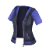       |
| 10101094   | 10101094NAME     |        |
| 10101095   | 10101095NAME     |        |
| 10101100   | 10101100NAME     |        |
| 10101101   | 10101101NAME     |        |
| 10101102   | 10101102NAME     |        |
| 10101110   | 10101110NAME     |        |
| 10101120   | 10101120NAME     |        |
| 10101130   | 10101130NAME     |        |
| 10101131   | 10101131NAME     |        |
| 10101132   | 10101132NAME     |        |
| 10101140   | 10101140NAME     |        |
| 10101141   | 10101141NAME     |        |
| 10101142   | 10101142NAME     |        |
| 10101150   | 10101150NAME     |        |
| 10101151   | 10101151NAME     |        |
| 10101152   | 10101152NAME     |        |
| 10101160   | 10101160NAME     |        |
| 10101170   | 10101170NAME     |        |
| 10101180   | 10101180NAME     |        |
| 10101190   | 10101190NAME     |        |
| 10101191   | 10101191NAME     |        |
| 10101200   | 10101200NAME     |        |
| 10101210   | 10101210NAME     |        |
| 10101220   | 10101220NAME     |        |
| 10101230   | 10101230NAME     |        |
| 10101240   | 10101240NAME     |        |
| 10101241   | 10101241NAME     |        |
| 10101250   | 10101250NAME     |        |
| 10101270   | 10101270NAME     |        |
| 10101290   | 10101290NAME     |        |
| 10101300   | 10101300NAME     |        |
| 10101310   | 10101310NAME     |        |
| 10101320   | 10101320NAME     |        |
| 10101330   | 10101330NAME     |        |
| 10101331   | 10101331NAME     |        |
| 10101332   | 10101332NAME     |        |
| 10101340   | 10101340NAME     |        |
| 10101341   | 10101341NAME     |        |
| 10101342   | 10101342NAME     |        |
| 10101350   | 10101350NAME     |        |
| 10101360   | 10101360NAME     |        |
| 10101370   | 10101370NAME     |        |
| 10101380   | 10101380NAME     |        |
| 10101390   | 10101390NAME     |        |
| 10101400   | 10101400NAME     |        |
| 10101410   | 10101410NAME     |        |
| 10101411   | 10101411NAME     |        |
| 10101420   | 10101420NAME     |        |
| 10101421   | 10101421NAME     |        |
| 10101430   | 10101430NAME     |        |
| 10101440   | 10101440NAME     |        |
| 10101441   | 10101441NAME     |        |
| 10101442   | 10101442NAME     |        |
| 10101450   | 10101450NAME     |        |
| 10101460   | 10101460NAME     |        |
| 10101461   | 10101461NAME     |        |
| 10101462   | 10101462NAME     |        |
| 10101470   | 10101470NAME     |        |
| 10101480   | 10101480NAME     |        |
| 10101481   | 10101481NAME     |        |
| 10101490   | 10101490NAME     |        |
| 10101500   | 10101500NAME     |        |
| 10101510   | 10101510NAME     |        |
| 10101520   | 10101520NAME     |        |
| 10101530   | 10101530NAME     |        |
| 10101540   | 10101540NAME     |        |
| 10101541   | 10101541NAME     |        |
| 10101550   | 10101550NAME     |        |
| 10101560   | 10101560NAME     |        |
| 10101580   | 10101580NAME     |        |
| 10101581   | 10101581NAME     |        |
| 10101590   | 10101590NAME     |        |
| 10101591   | 10101591NAME     |        |
| 10101620   | 10101620NAME     |        |
| 10101621   | 10101621NAME     |        |
| 10101630   | 10101630NAME     |        |
| 10101631   | 10101631NAME     |        |
| 10101640   | 10101640NAME     |        |
| 10101660   | 10101660NAME     |        |
| 10101670   | 10101670NAME     |        |
| 10101672   | 10101672NAME     |        |
| 10101681   | 10101681NAME     |        |
| 10101690   | 10101690NAME     |        |
| 10101700   | 10101700NAME     |        |
| 10101710   | 10101710NAME     |        |
| 10101720   | 10101720NAME     |        |
| 10101730   | 10101730NAME     |        |
| 10101740   | 10101740NAME     |        |
| 10101750   | 10101750NAME     |        |
| 10101760   | 10101760NAME     |        |
| 10101770   | 10101770NAME     |        |
| 10101780   | 10101780NAME     |        |
| 10101790   | 10101790NAME     |        |
| 10101800   | 10101800NAME     |        |
| 10101801   | 10101801NAME     |        |
| 10101810   | 10101810NAME     |        |
| 10101811   | 10101811NAME     |        |
| 10101820   | 10101820NAME     |        |
| 10101821   | 10101821NAME     |        |
| 10101830   | 10101830NAME     |        |
| 10101840   | 10101840NAME     |        |
| 10101841   | 10101841NAME     |        |
| 10101850   | 10101850NAME     |        |
| 10101851   | 10101851NAME     |        |
| 10101860   | 10101860NAME     |        |
| 10101870   | 10101870NAME     |        |
| 10101880   | 10101880NAME     |        |
| 10101890   | 10101890NAME     |        |
| 10101900   | 10101900NAME     |        |
| 10101910   | 10101910NAME     |        |
| 10101920   | 10101920NAME     |        |
| 10101930   | 10101930NAME     |        |
| 10101940   | 10101940NAME     |        |
| 10101950   | 10101950NAME     |        |
| 10101960   | 10101960NAME     |        |
| 10101970   | 10101970NAME     |        |
| 10101980   | 10101980NAME     |        |
| 10101990   | 10101990NAME     |        |
| 10102000   | 10102000NAME     |        |
| 10102010   | 10102010NAME     |        |
| 10102020   | 10102020NAME     |        |
| 10102030   | 10102030NAME     |        |
| 10102040   | 10102040NAME     |        |
| 10200000   | 10200000NAME     |        |
| 10200010   | 10200010NAME     |        |
| 10200013   | 10200013NAME     |        |
| 10200030   | 10200030NAME     |        |
| 10200040   | 10200040NAME     |        |
| 10200041   | 10200041NAME     |        |
| 10200042   | 10200042NAME     |        |
| 10200050   | 10200050NAME     |        |
| 10200051   | 10200051NAME     |        |
| 10200052   | 10200052NAME     |        |
| 10200053   | 10200053NAME     |        |
| 10200054   | 10200054NAME     |        |
| 10200060   | 10200060NAME     |        |
| 10200061   | 10200061NAME     |        |
| 10200062   | 10200062NAME     |        |
| 10200070   | 10200070NAME     |        |
| 10200071   | 10200071NAME     |        |
| 10200072   | 10200072NAME     |        |
| 10200073   | 10200073NAME     |        |
| 10200074   | 10200074NAME     |        |
| 10200080   | 10200080NAME     |        |
| 10200090   | 10200090NAME     |        |
| 10200091   | 10200091NAME     |        |
| 10200092   | 10200092NAME     | 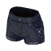       |
| 10200093   | 10200093NAME     |        |
| 10200094   | 10200094NAME     |        |
| 10200100   | 10200100NAME     |        |
| 10200101   | 10200101NAME     |        |
| 10200102   | 10200102NAME     |        |
| 10200103   | 10200103NAME     |        |
| 10200104   | 10200104NAME     |        |
| 10200105   | 10200105NAME     |        |
| 10200106   | 10200106NAME     |        |
| 10200110   | 10200110NAME     |        |
| 10200111   | 10200111NAME     |        |
| 10200112   | 10200112NAME     |        |
| 10200130   | 10200130NAME     |        |
| 10200131   | 10200131NAME     |        |
| 10200132   | 10200132NAME     |        |
| 10200140   | 10200140NAME     |        |
| 10200150   | 10200150NAME     |        |
| 10200151   | 10200151NAME     |        |
| 10200152   | 10200152NAME     |        |
| 10200160   | 10200160NAME     |        |
| 10200170   | 10200170NAME     |        |
| 10200180   | 10200180NAME     |        |
| 10200190   | 10200190NAME     |        |
| 10200200   | 10200200NAME     |        |
| 10200210   | 10200210NAME     |        |
| 10200250   | 10200250NAME     |        |
| 10200260   | 10200260NAME     |        |
| 10200262   | 10200262NAME     |        |
| 10200270   | 10200270NAME     |        |
| 10200280   | 10200280NAME     |        |
| 10200283   | 10200283NAME     |        |
| 10200290   | 10200290NAME     |        |
| 10200300   | 10200300NAME     |        |
| 10200301   | 10200301NAME     |        |
| 10200302   | 10200302NAME     |        |
| 10200303   | 10200303NAME     |        |
| 10200304   | 10200304NAME     |        |
| 10200305   | 10200305NAME     |        |
| 10200306   | 10200306NAME     |        |
| 10200307   | 10200307NAME     |        |
| 10200310   | 10200310NAME     |        |
| 10200311   | 10200311NAME     |        |
| 10200312   | 10200312NAME     |        |
| 10200320   | 10200320NAME     |        |
| 10200330   | 10200330NAME     |        |
| 10200331   | 10200331NAME     |        |
| 10200340   | 10200340NAME     |        |
| 10200341   | 10200341NAME     |        |
| 10200350   | 10200350NAME     |        |
| 10200351   | 10200351NAME     |        |
| 10200360   | 10200360NAME     |        |
| 10200361   | 10200361NAME     |        |
| 10200362   | 10200362NAME     |        |
| 10200370   | 10200370NAME     |        |
| 10200380   | 10200380NAME     |        |
| 10200381   | 10200381NAME     |        |
| 10200382   | 10200382NAME     |        |
| 10200383   | 10200383NAME     |        |
| 10200400   | 10200400NAME     |        |
| 10200410   | 10200410NAME     |        |
| 10200420   | 10200420NAME     |        |
| 10200421   | 10200421NAME     |        |
| 10200422   | 10200422NAME     |        |
| 10200423   | 10200423NAME     |        |
| 10200424   | 10200424NAME     |        |
| 10200430   | 10200430NAME     | 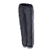       |
| 10200431   | 10200431NAME     |        |
| 10200432   | 10200432NAME     |        |
| 10200433   | 10200433NAME     |        |
| 10200434   | 10200434NAME     |        |
| 10200440   | 10200440NAME     |        |
| 10200450   | 10200450NAME     |        |
| 10200480   | 10200480NAME     |        |
| 10200481   | 10200481NAME     |        |
| 10200482   | 10200482NAME     |        |
| 10200490   | 10200490NAME     |        |
| 10200500   | 10200500NAME     |        |
| 10200510   | 10200510NAME     |        |
| 10200520   | 10200520NAME     |        |
| 10200530   | 10200530NAME     |        |
| 10200540   | 10200540NAME     | 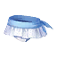       |
| 10200550   | 10200550NAME     |        |
| 10200560   | 10200560NAME     |        |
| 10200570   | 10200570NAME     |        |
| 10200580   | 10200580NAME     |        |
| 10200590   | 10200590NAME     |        |
| 10200600   | 10200600NAME     |        |
| 10200610   | 10200610NAME     |        |
| 10200611   | 10200611NAME     |        |
| 10200612   | 10200612NAME     |        |
| 10200620   | 10200620NAME     |        |
| 10200630   | 10200630NAME     |        |
| 10200640   | 10200640NAME     |        |
| 10200641   | 10200641NAME     |        |
| 10200650   | 10200650NAME     |        |
| 10200670   | 10200670NAME     |        |
| 10200671   | 10200671NAME     |        |
| 10200680   | 10200680NAME     |        |
| 10200700   | 10200700NAME     |        |
| 10200710   | 10200710NAME     |        |
| 10200712   | 10200712NAME     |        |
| 10200721   | 10200721NAME     |        |
| 10200730   | 10200730NAME     |        |
| 10200740   | 10200740NAME     |        |
| 10200750   | 10200750NAME     |        |
| 10200760   | 10200760NAME     |        |
| 10200761   | 10200761NAME     |        |
| 10200770   | 10200770NAME     |        |
| 10200771   | 10200771NAME     |        |
| 10200780   | 10200780NAME     |        |
| 10200790   | 10200790NAME     |        |
| 10200800   | 10200800NAME     |        |
| 10200810   | 10200810NAME     |        |
| 10200820   | 10200820NAME     |        |
| 10200830   | 10200830NAME     |        |
| 10200840   | 10200840NAME     |        |
| 10200850   | 10200850NAME     |        |
| 10300000   | 10300000NAME     |        |
| 10300002   | 10300002NAME     |        |
| 10300004   | 10300004NAME     |        |
| 10300010   | 10300010NAME     |        |
| 10300011   | 10300011NAME     |        |
| 10300012   | 10300012NAME     |        |
| 10300020   | 10300020NAME     |        |
| 10300030   | 10300030NAME     |        |
| 10300040   | 10300040NAME     |        |
| 10300050   | 10300050NAME     |        |
| 10300060   | 10300060NAME     |        |
| 10300070   | 10300070NAME     |        |
| 10300080   | 10300080NAME     |        |
| 10300081   | 10300081NAME     |        |
| 10300090   | 10300090NAME     |        |
| 10300100   | 10300100NAME     |        |
| 10300101   | 10300101NAME     |        |
| 10300110   | 10300110NAME     |        |
| 10300111   | 10300111NAME     |        |
| 10300120   | 10300120NAME     |        |
| 10300121   | 10300121NAME     |        |
| 10300122   | 10300122NAME     |        |
| 10300123   | 10300123NAME     |        |
| 10300124   | 10300124NAME     |        |
| 10300125   | 10300125NAME     |        |
| 10300130   | 10300130NAME     |        |
| 10300140   | 10300140NAME     |        |
| 10300141   | 10300141NAME     |        |
| 10300150   | 10300150NAME     |        |
| 10300160   | 10300160NAME     |        |
| 10300161   | 10300161NAME     |        |
| 10300170   | 10300170NAME     |        |
| 10300190   | 10300190NAME     |        |
| 10400000   | 10400000NAME     |        |
| 10400001   | 10400001NAME     | 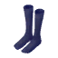       |
| 10400002   | 10400002NAME     |        |
| 10400003   | 10400003NAME     |        |
| 10400004   | 10400004NAME     |        |
| 10400010   | 10400010NAME     |        |
| 10400011   | 10400011NAME     |        |
| 10400012   | 10400012NAME     |        |
| 10400013   | 10400013NAME     |        |
| 10400014   | 10400014NAME     |        |
| 10400015   | 10400015NAME     |        |
| 10400016   | 10400016NAME     |        |
| 10400017   | 10400017NAME     |        |
| 10400018   | 10400018NAME     |        |
| 10400019   | 10400019NAME     | 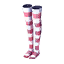       |
| 10400020   | 10400020NAME     |        |
| 10400021   | 10400021NAME     |        |
| 10400022   | 10400022NAME     |        |
| 10400023   | 10400023NAME     |        |
| 10400024   | 10400024NAME     |        |
| 10400030   | 10400030NAME     |        |
| 10400031   | 10400031NAME     |        |
| 10400032   | 10400032NAME     |        |
| 10400033   | 10400033NAME     |        |
| 10400034   | 10400034NAME     |        |
| 10400040   | 10400040NAME     |        |
| 10400041   | 10400041NAME     |        |
| 10400042   | 10400042NAME     |        |
| 10400043   | 10400043NAME     |        |
| 10400044   | 10400044NAME     |        |
| 10400045   | 10400045NAME     |        |
| 10400060   | 10400060NAME     |        |
| 10400061   | 10400061NAME     |        |
| 10400062   | 10400062NAME     |        |
| 10400070   | 10400070NAME     |        |
| 10400071   | 10400071NAME     |        |
| 10400080   | 10400080NAME     |        |
| 10400081   | 10400081NAME     |        |
| 10400090   | 10400090NAME     |        |
| 10400100   | 10400100NAME     |        |
| 10400110   | 10400110NAME     | 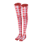       |
| 10400111   | 10400111NAME     |        |
| 10400112   | 10400112NAME     |        |
| 10400120   | 10400120NAME     |        |
| 10400121   | 10400121NAME     |        |
| 10400122   | 10400122NAME     |        |
| 10400130   | 10400130NAME     |        |
| 10400131   | 10400131NAME     |        |
| 10400132   | 10400132NAME     |        |
| 10400140   | 10400140NAME     |        |
| 10400150   | 10400150NAME     |        |
| 10400160   | 10400160NAME     |        |
| 10400161   | 10400161NAME     |        |
| 10400170   | 10400170NAME     |        |
| 10400180   | 10400180NAME     |        |
| 10400190   | 10400190NAME     |        |
| 10400200   | 10400200NAME     |        |
| 10400210   | 10400210NAME     |        |
| 10400220   | 10400220NAME     |        |
| 10400221   | 10400221NAME     |        |
| 10400230   | 10400230NAME     |        |
| 10400240   | 10400240NAME     |        |
| 10400250   | 10400250NAME     |        |
| 10400260   | 10400260NAME     |        |
| 10400270   | 10400270NAME     |        |
| 10400280   | 10400280NAME     |        |
| 10400300   | 10400300NAME     | 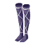       |
| 10400310   | 10400310NAME     |        |
| 10400320   | 10400320NAME     |        |
| 10400330   | 10400330NAME     |        |
| 10400340   | 10400340NAME     |        |
| 10499990   | 10499990NAME     |        |
| 10499991   | 10499991NAME     |        |
| 10499992   | 10499992NAME     |        |
| 10499999   | 10499999NAME     |        |
| 10500000   | 10500000NAME     |        |
| 10500010   | 10500010NAME     |        |
| 10500011   | 10500011NAME     |        |
| 10500012   | 10500012NAME     |        |
| 10500013   | 10500013NAME     |        |
| 10500014   | 10500014NAME     |        |
| 10500020   | 10500020NAME     |        |
| 10500021   | 10500021NAME     |        |
| 10500022   | 10500022NAME     |        |
| 10500023   | 10500023NAME     |        |
| 10500024   | 10500024NAME     |        |
| 10500030   | 10500030NAME     |        |
| 10500040   | 10500040NAME     |        |
| 10500041   | 10500041NAME     |        |
| 10500045   | 10500045NAME     |        |
| 10500046   | 10500046NAME     |        |
| 10500047   | 10500047NAME     |        |
| 10500048   | 10500048NAME     | 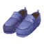       |
| 10500050   | 10500050NAME     |        |
| 10500060   | 10500060NAME     |        |
| 10500070   | 10500070NAME     |        |
| 10500071   | 10500071NAME     |        |
| 10500072   | 10500072NAME     |        |
| 10500090   | 10500090NAME     |        |
| 10500091   | 10500091NAME     |        |
| 10500100   | 10500100NAME     |        |
| 10500101   | 10500101NAME     |        |
| 10500102   | 10500102NAME     |        |
| 10500110   | 10500110NAME     |        |
| 10500111   | 10500111NAME     |        |
| 10500112   | 10500112NAME     |        |
| 10500120   | 10500120NAME     |        |
| 10500130   | 10500130NAME     |        |
| 10500131   | 10500131NAME     |        |
| 10500132   | 10500132NAME     |        |
| 10500133   | 10500133NAME     |        |
| 10500134   | 10500134NAME     |        |
| 10500135   | 10500135NAME     |        |
| 10500150   | 10500150NAME     |        |
| 10500151   | 10500151NAME     |        |
| 10500152   | 10500152NAME     |        |
| 10500160   | 10500160NAME     |        |
| 10500180   | 10500180NAME     |        |
| 10500190   | 10500190NAME     |        |
| 10500191   | 10500191NAME     |        |
| 10500192   | 10500192NAME     |        |
| 10500200   | 10500200NAME     |        |
| 10500201   | 10500201NAME     |        |
| 10500210   | 10500210NAME     |        |
| 10500211   | 10500211NAME     |        |
| 10500212   | 10500212NAME     |        |
| 10500213   | 10500213NAME     |        |
| 10500214   | 10500214NAME     |        |
| 10500215   | 10500215NAME     |        |
| 10500220   | 10500220NAME     |        |
| 10500230   | 10500230NAME     |        |
| 10500231   | 10500231NAME     |        |
| 10500240   | 10500240NAME     |        |
| 10500241   | 10500241NAME     |        |
| 10500242   | 10500242NAME     |        |
| 10500250   | 10500250NAME     |        |
| 10500260   | 10500260NAME     |        |
| 10500261   | 10500261NAME     |        |
| 10500262   | 10500262NAME     |        |
| 10500263   | 10500263NAME     |        |
| 10500270   | 10500270NAME     |        |
| 10500271   | 10500271NAME     |        |
| 10500280   | 10500280NAME     |        |
| 10500281   | 10500281NAME     |        |
| 10500290   | 10500290NAME     |        |
| 10500291   | 10500291NAME     |        |
| 10500300   | 10500300NAME     |        |
| 10500310   | 10500310NAME     |        |
| 10500320   | 10500320NAME     |        |
| 10500330   | 10500330NAME     |        |
| 10500340   | 10500340NAME     |        |
| 10500360   | 10500360NAME     |        |
| 10500361   | 10500361NAME     |        |
| 10500370   | 10500370NAME     |        |
| 10500371   | 10500371NAME     |        |
| 10500372   | 10500372NAME     |        |
| 10500380   | 10500380NAME     |        |
| 10500390   | 10500390NAME     |        |
| 10500391   | 10500391NAME     |        |
| 10500400   | 10500400NAME     |        |
| 10500401   | 10500401NAME     |        |
| 10500402   | 10500402NAME     |        |
| 10500410   | 10500410NAME     |        |
| 10500420   | 10500420NAME     |        |
| 10500421   | 10500421NAME     |        |
| 10500430   | 10500430NAME     |        |
| 10500431   | 10500431NAME     |        |
| 10500440   | 10500440NAME     |        |
| 10500450   | 10500450NAME     |        |
| 10500451   | 10500451NAME     |        |
| 10500460   | 10500460NAME     |        |
| 10500470   | 10500470NAME     |        |
| 10500480   | 10500480NAME     |        |
| 10500481   | 10500481NAME     |        |
| 10500490   | 10500490NAME     |        |
| 10500510   | 10500510NAME     |        |
| 10500530   | 10500530NAME     |        |
| 10500540   | 10500540NAME     |        |
| 10500550   | 10500550NAME     |        |
| 10500560   | 10500560NAME     |        |
| 10500570   | 10500570NAME     |        |
| 10500580   | 10500580NAME     |        |
| 10500590   | 10500590NAME     |        |
| 10500600   | 10500600NAME     |        |
| 10500610   | 10500610NAME     |        |
| 10500611   | 10500611NAME     |        |
| 10500612   | 10500612NAME     |        |
| 10500620   | 10500620NAME     |        |
| 10500630   | 10500630NAME     | 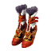       |
| 10500631   | 10500631NAME     |        |
| 10500640   | 10500640NAME     |        |
| 10500650   | 10500650NAME     |        |
| 10500651   | 10500651NAME     |        |
| 10500652   | 10500652NAME     |        |
| 10500660   | 10500660NAME     |        |
| 10500670   | 10500670NAME     |        |
| 10500671   | 10500671NAME     |        |
| 10500680   | 10500680NAME     |        |
| 10500690   | 10500690NAME     |        |
| 10500700   | 10500700NAME     |        |
| 10500710   | 10500710NAME     |        |
| 10500720   | 10500720NAME     |        |
| 10500730   | 10500730NAME     |        |
| 10500740   | 10500740NAME     |        |
| 10500750   | 10500750NAME     |        |
| 10500760   | 10500760NAME     |        |
| 10600000   | 10600000NAME     |        |
| 10600001   | 10600001NAME     |        |
| 10600002   | 10600002NAME     |        |
| 10600010   | 10600010NAME     |        |
| 10600013   | 10600013NAME     |        |
| 10600014   | 10600014NAME     |        |
| 10600015   | 10600015NAME     |        |
| 10600016   | 10600016NAME     |        |
| 10600020   | 10600020NAME     |        |
| 10600030   | 10600030NAME     |        |
| 10600040   | 10600040NAME     |        |
| 10600043   | 10600043NAME     |        |
| 10600044   | 10600044NAME     |        |
| 10600050   | 10600050NAME     |        |
| 10600070   | 10600070NAME     |        |
| 10600080   | 10600080NAME     |        |
| 10600090   | 10600090NAME     |        |
| 10600100   | 10600100NAME     |        |
| 10600110   | 10600110NAME     |        |
| 10600120   | 10600120NAME     |        |
| 10600121   | 10600121NAME     |        |
| 10600122   | 10600122NAME     |        |
| 10700000   | 10700000NAME     |        |
| 10700001   | 10700001NAME     |        |
| 10700002   | 10700002NAME     |        |
| 10700010   | 10700010NAME     |        |
| 10700013   | 10700013NAME     |        |
| 10700014   | 10700014NAME     |        |
| 10700015   | 10700015NAME     |        |
| 10700016   | 10700016NAME     |        |
| 10700020   | 10700020NAME     |        |
| 10700030   | 10700030NAME     |        |
| 10700031   | 10700031NAME     |        |
| 10700032   | 10700032NAME     |        |
| 10700040   | 10700040NAME     |        |
| 10700041   | 10700041NAME     |        |
| 10700042   | 10700042NAME     |        |
| 10700050   | 10700050NAME     | 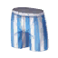       |
| 10700051   | 10700051NAME     |        |
| 10700052   | 10700052NAME     |        |
| 10700060   | 10700060NAME     |        |
| 10700061   | 10700061NAME     |        |
| 10700062   | 10700062NAME     |        |
| 10700063   | 10700063NAME     |        |
| 10700070   | 10700070NAME     |        |
| 10700071   | 10700071NAME     |        |
| 10700072   | 10700072NAME     |        |
| 10700080   | 10700080NAME     |        |
| 10700090   | 10700090NAME     |        |
| 10700100   | 10700100NAME     | 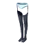       |
| 10700110   | 10700110NAME     |        |
| 10700111   | 10700111NAME     |        |
| 10700112   | 10700112NAME     |        |
| 10700130   | 10700130NAME     |        |
| 10700131   | 10700131NAME     |        |
| 10700140   | 10700140NAME     |        |
| 10700150   | 10700150NAME     |        |
| 10700160   | 10700160NAME     |        |
| 10700170   | 10700170NAME     |        |
| 10700180   | 10700180NAME     |        |
| 10700190   | 10700190NAME     |        |
| 10700200   | 10700200NAME     |        |
| 10700201   | 10700201NAME     |        |
| 10700202   | 10700202NAME     |        |
| 10700210   | 10700210NAME     |        |
| 10800000   | 10800000NAME     |        |
| 10800010   | 10800010NAME     |        |
| 10800011   | 10800011NAME     |        |
| 10800012   | 10800012NAME     |        |
| 10800013   | 10800013NAME     |        |
| 10800014   | 10800014NAME     |        |
| 10800020   | 10800020NAME     |        |
| 10800021   | 10800021NAME     |        |
| 10800022   | 10800022NAME     |        |
| 10800023   | 10800023NAME     |        |
| 10800030   | 10800030NAME     |        |
| 10800031   | 10800031NAME     |        |
| 10800032   | 10800032NAME     |        |
| 10800040   | 10800040NAME     |        |
| 10800041   | 10800041NAME     |        |
| 10800042   | 10800042NAME     |        |
| 10800050   | 10800050NAME     |        |
| 10800060   | 10800060NAME     |        |
| 10800061   | 10800061NAME     |        |
| 10800062   | 10800062NAME     |        |
| 10800070   | 10800070NAME     |        |
| 10800080   | 10800080NAME     |        |
| 10800081   | 10800081NAME     |        |
| 10800082   | 10800082NAME     |        |
| 10800090   | 10800090NAME     |        |
| 10800091   | 10800091NAME     |        |
| 10800092   | 10800092NAME     |        |
| 10800093   | 10800093NAME     |        |
| 10800094   | 10800094NAME     |        |
| 10800095   | 10800095NAME     |        |
| 10800100   | 10800100NAME     |        |
| 10800101   | 10800101NAME     |        |
| 10800110   | 10800110NAME     |        |
| 10800120   | 10800120NAME     |        |
| 10800121   | 10800121NAME     |        |
| 10800130   | 10800130NAME     |        |
| 10800131   | 10800131NAME     |        |
| 10800150   | 10800150NAME     |        |
| 10800151   | 10800151NAME     |        |
| 10800152   | 10800152NAME     |        |
| 10800153   | 10800153NAME     |        |
| 10800160   | 10800160NAME     |        |
| 10800161   | 10800161NAME     |        |
| 10800190   | 10800190NAME     |        |
| 10800191   | 10800191NAME     |        |
| 10800192   | 10800192NAME     |        |
| 10800193   | 10800193NAME     |        |
| 10800200   | 10800200NAME     |        |
| 10800201   | 10800201NAME     |        |
| 10800202   | 10800202NAME     |        |
| 10800203   | 10800203NAME     |        |
| 10800210   | 10800210NAME     |        |
| 10800211   | 10800211NAME     |        |
| 10800212   | 10800212NAME     |        |
| 10800213   | 10800213NAME     |        |
| 10899999   | 10899999NAME     |        |
| 10900000   | 10900000NAME     |        |
| 10900010   | 10900010NAME     |        |
| 10900020   | 10900020NAME     |        |
| 10900030   | 10900030NAME     |        |
| 10900031   | 10900031NAME     |        |
| 10900032   | 10900032NAME     |        |
| 10900033   | 10900033NAME     |        |
| 10900034   | 10900034NAME     |        |
| 10900040   | 10900040NAME     |        |
| 10900041   | 10900041NAME     |        |
| 10900042   | 10900042NAME     |        |
| 10900043   | 10900043NAME     |        |
| 10900044   | 10900044NAME     |        |
| 10900050   | 10900050NAME     |        |
| 10900051   | 10900051NAME     |        |
| 10900052   | 10900052NAME     |        |
| 10900053   | 10900053NAME     |        |
| 10900054   | 10900054NAME     |        |
| 10900060   | 10900060NAME     |        |
| 10900061   | 10900061NAME     |        |
| 10900062   | 10900062NAME     |        |
| 10900063   | 10900063NAME     | 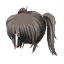       |
| 10900064   | 10900064NAME     |        |
| 10900070   | 10900070NAME     |        |
| 10900071   | 10900071NAME     |        |
| 10900072   | 10900072NAME     |        |
| 10900073   | 10900073NAME     |        |
| 10900074   | 10900074NAME     |        |
| 10900080   | 10900080NAME     |        |
| 10900081   | 10900081NAME     |        |
| 10900082   | 10900082NAME     |        |
| 10900083   | 10900083NAME     |        |
| 10900084   | 10900084NAME     |        |
| 10900100   | 10900100NAME     |        |
| 10900101   | 10900101NAME     |        |
| 10900102   | 10900102NAME     |        |
| 10900103   | 10900103NAME     |        |
| 10900104   | 10900104NAME     |        |
| 10900110   | 10900110NAME     |        |
| 10900111   | 10900111NAME     |        |
| 10900112   | 10900112NAME     |        |
| 10900113   | 10900113NAME     |        |
| 10900114   | 10900114NAME     |        |
| 10900120   | 10900120NAME     |        |
| 10900121   | 10900121NAME     |        |
| 10900122   | 10900122NAME     |        |
| 10900123   | 10900123NAME     |        |
| 10900124   | 10900124NAME     |        |
| 10900140   | 10900140NAME     |        |
| 10900141   | 10900141NAME     |        |
| 10900142   | 10900142NAME     |        |
| 10900143   | 10900143NAME     |        |
| 10900144   | 10900144NAME     |        |
| 10900150   | 10900150NAME     |        |
| 10900151   | 10900151NAME     |        |
| 10900152   | 10900152NAME     |        |
| 10900153   | 10900153NAME     |        |
| 10900154   | 10900154NAME     |        |
| 10900160   | 10900160NAME     |        |
| 10900161   | 10900161NAME     |        |
| 10900162   | 10900162NAME     |        |
| 10900163   | 10900163NAME     |        |
| 10900164   | 10900164NAME     |        |
| 10900170   | 10900170NAME     |        |
| 10900171   | 10900171NAME     |        |
| 10900172   | 10900172NAME     |        |
| 10900173   | 10900173NAME     |        |
| 10900174   | 10900174NAME     |        |
| 10900180   | 10900180NAME     |        |
| 10900181   | 10900181NAME     |        |
| 10900182   | 10900182NAME     |        |
| 10900183   | 10900183NAME     |        |
| 10900184   | 10900184NAME     |        |
| 10900200   | 10900200NAME     |        |
| 10900201   | 10900201NAME     |        |
| 10900210   | 10900210NAME     |        |
| 10900211   | 10900211NAME     |        |
| 10900220   | 10900220NAME     |        |
| 10900221   | 10900221NAME     |        |
| 10900230   | 10900230NAME     |        |
| 10900231   | 10900231NAME     |        |
| 10900240   | 10900240NAME     |        |
| 10900241   | 10900241NAME     |        |
| 10900250   | 10900250NAME     |        |
| 10900251   | 10900251NAME     |        |
| 10900260   | 10900260NAME     |        |
| 10900270   | 10900270NAME     |        |
| 10900280   | 10900280NAME     |        |
| 10900290   | 10900290NAME     |        |
| 10900300   | 10900300NAME     |        |
| 10900301   | 10900301NAME     |        |
| 10900310   | 10900310NAME     |        |
| 10910010   | 10910010NAME     |        |
| 10910020   | 10910020NAME     |        |
| 10920010   | 10920010NAME     |        |
| 10920011   | 10920011NAME     |        |
| 10920012   | 10920012NAME     |        |
| 10920013   | 10920013NAME     |        |
| 10920014   | 10920014NAME     |        |
| 10920020   | 10920020NAME     |        |
| 10920021   | 10920021NAME     |        |
| 10920022   | 10920022NAME     |        |
| 10920023   | 10920023NAME     |        |
| 10920024   | 10920024NAME     |        |
| 10920030   | 10920030NAME     |        |
| 10920031   | 10920031NAME     |        |
| 10920032   | 10920032NAME     |        |
| 10920033   | 10920033NAME     |        |
| 10920034   | 10920034NAME     |        |
| 10920040   | 10920040NAME     |        |
| 10920041   | 10920041NAME     |        |
| 10920042   | 10920042NAME     |        |
| 10920043   | 10920043NAME     |        |
| 10920044   | 10920044NAME     |        |
| 10930010   | 10930010NAME     |        |
| 10930011   | 10930011NAME     |        |
| 10930012   | 10930012NAME     |        |
| 10930013   | 10930013NAME     |        |
| 10930014   | 10930014NAME     |        |
| 10930020   | 10930020NAME     |        |
| 10930021   | 10930021NAME     |        |
| 10930022   | 10930022NAME     |        |
| 10930023   | 10930023NAME     |        |
| 10930024   | 10930024NAME     |        |
| 10930030   | 10930030NAME     |        |
| 10930031   | 10930031NAME     |        |
| 10930032   | 10930032NAME     |        |
| 10930033   | 10930033NAME     |        |
| 10930034   | 10930034NAME     |        |
| 10930040   | 10930040NAME     |        |
| 10930041   | 10930041NAME     |        |
| 10930042   | 10930042NAME     |        |
| 10930043   | 10930043NAME     |        |
| 10930044   | 10930044NAME     |        |
| 10930050   | 10930050NAME     |        |
| 10930051   | 10930051NAME     |        |
| 10930052   | 10930052NAME     |        |
| 10930053   | 10930053NAME     |        |
| 10930054   | 10930054NAME     |        |
| 10930055   | 10930055NAME     |        |
| 10930056   | 10930056NAME     |        |
| 10930060   | 10930060NAME     |        |
| 10930070   | 10930070NAME     |        |
| 10930080   | 10930080NAME     |        |
| 10930090   | 10930090NAME     |        |
| 10930091   | 10930091NAME     |        |
| 10930100   | 10930100NAME     |        |
| 10930120   | 10930120NAME     |        |
| 10930130   | 10930130NAME     |        |
| 10930140   | 10930140NAME     |        |
| 10930150   | 10930150NAME     |        |
| 10930160   | 10930160NAME     |        |
| 10930170   | 10930170NAME     |        |
| 10930180   | 10930180NAME     |        |
| 10930181   | 10930181NAME     |        |
| 10930190   | 10930190NAME     |        |
| 10930191   | 10930191NAME     |        |
| 10930200   | 10930200NAME     |        |
| 10930201   | 10930201NAME     |        |
| 10930210   | 10930210NAME     |        |
| 10930220   | 10930220NAME     |        |
| 10930221   | 10930221NAME     |        |
| 10930230   | 10930230NAME     |        |
| 10930240   | 10930240NAME     |        |
| 10930250   | 10930250NAME     |        |
| 10930260   | 10930260NAME     |        |
| 10930270   | 10930270NAME     |        |
| 10930280   | 10930280NAME     |        |
| 10930290   | 10930290NAME     |        |
| 10930291   | 10930291NAME     |        |
| 10930300   | 10930300NAME     |        |
| 10930301   | 10930301NAME     |        |
| 10930310   | 10930310NAME     |        |
| 10930311   | 10930311NAME     |        |
| 10930320   | 10930320NAME     |        |
| 10930321   | 10930321NAME     |        |
| 10930330   | 10930330NAME     |        |
| 10930340   | 10930340NAME     |        |
| 10930350   | 10930350NAME     |        |
| 10930360   | 10930360NAME     |        |
| 10930370   | 10930370NAME     |        |
| 11000000   | 11000000NAME     |        |
| 11000001   | 11000001NAME     |        |
| 11000002   | 11000002NAME     |        |
| 11000003   | 11000003NAME     |        |
| 11000010   | 11000010NAME     |        |
| 11000011   | 11000011NAME     |        |
| 11000012   | 11000012NAME     |        |
| 11000013   | 11000013NAME     |        |
| 11000014   | 11000014NAME     |        |
| 11000015   | 11000015NAME     |        |
| 11000020   | 11000020NAME     |        |
| 11000030   | 11000030NAME     |        |
| 11000040   | 11000040NAME     |        |
| 11000041   | 11000041NAME     |        |
| 11000042   | 11000042NAME     |        |
| 11000043   | 11000043NAME     |        |
| 11000050   | 11000050NAME     |        |
| 11000051   | 11000051NAME     |        |
| 11000052   | 11000052NAME     |        |
| 11000053   | 11000053NAME     |        |
| 11000060   | 11000060NAME     |        |
| 11000070   | 11000070NAME     |        |
| 11000080   | 11000080NAME     |        |
| 11000090   | 11000090NAME     |        |
| 11000100   | 11000100NAME     |        |
| 11000101   | 11000101NAME     |        |
| 11000102   | 11000102NAME     |        |
| 11000103   | 11000103NAME     |        |
| 11000110   | 11000110NAME     |        |
| 11000120   | 11000120NAME     |        |
| 11000130   | 11000130NAME     |        |
| 11000131   | 11000131NAME     |        |
| 11000132   | 11000132NAME     |        |
| 11000133   | 11000133NAME     |        |
| 11000134   | 11000134NAME     |        |
| 11000135   | 11000135NAME     |        |
| 11000136   | 11000136NAME     |        |
| 11000137   | 11000137NAME     |        |
| 11000138   | 11000138NAME     |        |
| 11000139   | 11000139NAME     |        |
| 11000140   | 11000140NAME     |        |
| 11000150   | 11000150NAME     |        |
| 11000160   | 11000160NAME     |        |
| 11000170   | 11000170NAME     |        |
| 11000171   | 11000171NAME     |        |
| 11000172   | 11000172NAME     | 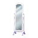       |
| 11000173   | 11000173NAME     |        |
| 11000174   | 11000174NAME     |        |
| 11000175   | 11000175NAME     |        |
| 11000180   | 11000180NAME     |        |
| 11000190   | 11000190NAME     |        |
| 11000200   | 11000200NAME     |        |
| 11000210   | 11000210NAME     |        |
| 11000220   | 11000220NAME     |        |
| 11000230   | 11000230NAME     |        |
| 11000240   | 11000240NAME     |        |
| 11000250   | 11000250NAME     |        |
| 11000251   | 11000251NAME     |        |
| 11000252   | 11000252NAME     |        |
| 11000253   | 11000253NAME     |        |
| 11000260   | 11000260NAME     |        |
| 11000270   | 11000270NAME     |        |
| 11000280   | 11000280NAME     |        |
| 11000281   | 11000281NAME     |        |
| 11000282   | 11000282NAME     |        |
| 11000290   | 11000290NAME     |        |
| 11000300   | 11000300NAME     |        |
| 11000310   | 11000310NAME     |        |
| 11000320   | 11000320NAME     |        |
| 11000321   | 11000321NAME     |        |
| 11000322   | 11000322NAME     |        |
| 11000330   | 11000330NAME     |        |
| 11000340   | 11000340NAME     |        |
| 11000350   | 11000350NAME     |        |
| 11000550   | 11000550NAME     |        |
| 11000551   | 11000551NAME     |        |
| 11000552   | 11000552NAME     |        |
| 11000560   | 11000560NAME     |        |
| 11000561   | 11000561NAME     |        |
| 11000562   | 11000562NAME     |        |
| 11000570   | 11000570NAME     |        |
| 11000571   | 11000571NAME     |        |
| 11000572   | 11000572NAME     |        |
| 11000573   | 11000573NAME     |        |
| 11000574   | 11000574NAME     |        |
| 11000580   | 11000580NAME     |        |
| 11000581   | 11000581NAME     |        |
| 11000582   | 11000582NAME     |        |
| 11000583   | 11000583NAME     | 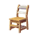       |
| 11000584   | 11000584NAME     |        |
| 11000590   | 11000590NAME     |        |
| 11000591   | 11000591NAME     |        |
| 11000600   | 11000600NAME     |        |
| 11000601   | 11000601NAME     |        |
| 11000602   | 11000602NAME     |        |
| 11000603   | 11000603NAME     |        |
| 11000604   | 11000604NAME     |        |
| 11000605   | 11000605NAME     |        |
| 11000606   | 11000606NAME     |        |
| 11000607   | 11000607NAME     |        |
| 11000610   | 11000610NAME     |        |
| 11000611   | 11000611NAME     |        |
| 11000612   | 11000612NAME     |        |
| 11000613   | 11000613NAME     |        |
| 11000614   | 11000614NAME     |        |
| 11000615   | 11000615NAME     |        |
| 11000616   | 11000616NAME     |        |
| 11000617   | 11000617NAME     |        |
| 11000618   | 11000618NAME     |        |
| 11000620   | 11000620NAME     |        |
| 11000621   | 11000621NAME     |        |
| 11000622   | 11000622NAME     |        |
| 11000623   | 11000623NAME     |        |
| 11000624   | 11000624NAME     | 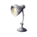       |
| 11000625   | 11000625NAME     |        |
| 11000630   | 11000630NAME     | 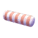       |
| 11000631   | 11000631NAME     |        |
| 11000632   | 11000632NAME     |        |
| 11000640   | 11000640NAME     |        |
| 11000650   | 11000650NAME     |        |
| 11000660   | 11000660NAME     |        |
| 11000700   | 11000700NAME     |        |
| 11000710   | 11000710NAME     |        |
| 11000720   | 11000720NAME     |        |
| 11000730   | 11000730NAME     |        |
| 11000740   | 11000740NAME     |        |
| 11000750   | 11000750NAME     |        |
| 11000760   | 11000760NAME     |        |
| 11000770   | 11000770NAME     |        |
| 11000780   | 11000780NAME     |        |
| 11000790   | 11000790NAME     |        |
| 11000800   | 11000800NAME     |        |
| 11000810   | 11000810NAME     |        |
| 11000820   | 11000820NAME     |        |
| 11000830   | 11000830NAME     |        |
| 11000840   | 11000840NAME     |        |
| 11000850   | 11000850NAME     |        |
| 11000860   | 11000860NAME     |        |
| 11000870   | 11000870NAME     |        |
| 11000880   | 11000880NAME     |        |
| 11000890   | 11000890NAME     |        |
| 11000900   | 11000900NAME     |        |
| 11000910   | 11000910NAME     |        |
| 11000920   | 11000920NAME     |        |
| 11000930   | 11000930NAME     |        |
| 11000940   | 11000940NAME     |        |
| 11000950   | 11000950NAME     |        |
| 11000960   | 11000960NAME     |        |
| 11000970   | 11000970NAME     |        |
| 11000971   | 11000971NAME     |        |
| 11000972   | 11000972NAME     |        |
| 11000973   | 11000973NAME     |        |
| 11000974   | 11000974NAME     |        |
| 11000975   | 11000975NAME     |        |
| 11000976   | 11000976NAME     |        |
| 11000977   | 11000977NAME     |        |
| 11000978   | 11000978NAME     |        |
| 11000980   | 11000980NAME     |        |
| 11000981   | 11000981NAME     |        |
| 11000982   | 11000982NAME     |        |
| 11000983   | 11000983NAME     |        |
| 11000990   | 11000990NAME     |        |
| 11000991   | 11000991NAME     |        |
| 11000992   | 11000992NAME     |        |
| 11000993   | 11000993NAME     |        |
| 11000994   | 11000994NAME     |        |
| 11000995   | 11000995NAME     |        |
| 11001000   | 11001000NAME     |        |
| 11001010   | 11001010NAME     |        |
| 11001020   | 11001020NAME     |        |
| 11001030   | 11001030NAME     |        |
| 11001040   | 11001040NAME     |        |
| 11001050   | 11001050NAME     |        |
| 11001060   | 11001060NAME     |        |
| 11001070   | 11001070NAME     |        |
| 11001080   | 11001080NAME     |        |
| 11001090   | 11001090NAME     |        |
| 11001100   | 11001100NAME     |        |
| 11001110   | 11001110NAME     |        |
| 11001120   | 11001120NAME     |        |
| 11001121   | 11001121NAME     |        |
| 11001122   | 11001122NAME     |        |
| 11001123   | 11001123NAME     |        |
| 11001124   | 11001124NAME     |        |
| 11001125   | 11001125NAME     |        |
| 11001126   | 11001126NAME     |        |
| 11001127   | 11001127NAME     |        |
| 11001128   | 11001128NAME     |        |
| 11001130   | 11001130NAME     |        |
| 11001131   | 11001131NAME     |        |
| 11001132   | 11001132NAME     |        |
| 11001133   | 11001133NAME     |        |
| 11001140   | 11001140NAME     |        |
| 11001150   | 11001150NAME     |        |
| 11001160   | 11001160NAME     |        |
| 11001161   | 11001161NAME     |        |
| 11001162   | 11001162NAME     |        |
| 11001164   | 11001164NAME     |        |
| 11001165   | 11001165NAME     |        |
| 11001166   | 11001166NAME     |        |
| 11001167   | 11001167NAME     |        |
| 11001168   | 11001168NAME     |        |
| 11001170   | 11001170NAME     |        |
| 11001171   | 11001171NAME     |        |
| 11001172   | 11001172NAME     |        |
| 11001180   | 11001180NAME     |        |
| 11001190   | 11001190NAME     |        |
| 11001200   | 11001200NAME     |        |
| 11001210   | 11001210NAME     |        |
| 11001211   | 11001211NAME     |        |
| 11001220   | 11001220NAME     |        |
| 11001230   | 11001230NAME     |        |
| 11001240   | 11001240NAME     |        |
| 11001250   | 11001250NAME     |        |
| 11001260   | 11001260NAME     |        |
| 11001270   | 11001270NAME     |        |
| 11001280   | 11001280NAME     |        |
| 11001290   | 11001290NAME     |        |
| 11001291   | 11001291NAME     |        |
| 11001292   | 11001292NAME     |        |
| 11001293   | 11001293NAME     |        |
| 11001294   | 11001294NAME     |        |
| 11001300   | 11001300NAME     |        |
| 11001301   | 11001301NAME     |        |
| 11001302   | 11001302NAME     |        |
| 11001303   | 11001303NAME     |        |
| 11001310   | 11001310NAME     |        |
| 11001320   | 11001320NAME     |        |
| 11001330   | 11001330NAME     |        |
| 11001331   | 11001331NAME     |        |
| 11001332   | 11001332NAME     |        |
| 11001334   | 11001334NAME     |        |
| 11001335   | 11001335NAME     |        |
| 11001336   | 11001336NAME     |        |
| 11001337   | 11001337NAME     |        |
| 11001338   | 11001338NAME     |        |
| 11001339   | 11001339NAME     |        |
| 11001340   | 11001340NAME     |        |
| 11001341   | 11001341NAME     |        |
| 11001342   | 11001342NAME     |        |
| 11001343   | 11001343NAME     |        |
| 11001344   | 11001344NAME     |        |
| 11001346   | 11001346NAME     |        |
| 11001347   | 11001347NAME     |        |
| 11001348   | 11001348NAME     |        |
| 11001349   | 11001349NAME     |        |
| 11001350   | 11001350NAME     |        |
| 11001351   | 11001351NAME     |        |
| 11001352   | 11001352NAME     |        |
| 11001353   | 11001353NAME     |        |
| 11001354   | 11001354NAME     |        |
| 11001360   | 11001360NAME     |        |
| 11001371   | 11001371NAME     | 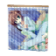       |
| 11001372   | 11001372NAME     |        |
| 11001373   | 11001373NAME     |        |
| 11001374   | 11001374NAME     |        |
| 11001375   | 11001375NAME     |        |
| 11001376   | 11001376NAME     |        |
| 11001378   | 11001378NAME     |        |
| 11001379   | 11001379NAME     |        |
| 11001380   | 11001380NAME     |        |
| 11001381   | 11001381NAME     |        |
| 11001382   | 11001382NAME     |        |
| 11001383   | 11001383NAME     |        |
| 11001384   | 11001384NAME     |        |
| 11001385   | 11001385NAME     |        |
| 11001387   | 11001387NAME     |        |
| 11001388   | 11001388NAME     |        |
| 11001390   | 11001390NAME     |        |
| 11001400   | 11001400NAME     |        |
| 11001410   | 11001410NAME     |        |
| 11001411   | 11001411NAME     |        |
| 11001412   | 11001412NAME     |        |
| 11001413   | 11001413NAME     |        |
| 11001420   | 11001420NAME     |        |
| 11001421   | 11001421NAME     |        |
| 11001422   | 11001422NAME     |        |
| 11001423   | 11001423NAME     |        |
| 11001424   | 11001424NAME     |        |
| 11001425   | 11001425NAME     |        |
| 11001426   | 11001426NAME     |        |
| 11001427   | 11001427NAME     |        |
| 11001430   | 11001430NAME     |        |
| 11001440   | 11001440NAME     |        |
| 11001441   | 11001441NAME     |        |
| 11001442   | 11001442NAME     |        |
| 11001443   | 11001443NAME     |        |
| 11001450   | 11001450NAME     | 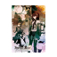       |
| 11001451   | 11001451NAME     |        |
| 11001452   | 11001452NAME     |        |
| 11001453   | 11001453NAME     |        |
| 11001454   | 11001454NAME     |        |
| 11001455   | 11001455NAME     |        |
| 11001460   | 11001460NAME     |        |
| 11001480   | 11001480NAME     |        |
| 11001490   | 11001490NAME     |        |
| 11001500   | 11001500NAME     |        |
| 11001510   | 11001510NAME     |        |
| 11001520   | 11001520NAME     |        |
| 11001530   | 11001530NAME     |        |
| 11001540   | 11001540NAME     |        |
| 11400000   | 11400000NAME     |        |
| 11400001   | 11400001NAME     |        |
| 11400002   | 11400002NAME     |        |
| 11400003   | 11400003NAME     |        |
| 11400004   | 11400004NAME     |        |
| 11400005   | 11400005NAME     |        |
| 11400010   | 11400010NAME     |        |
| 11400011   | 11400011NAME     |        |
| 11400012   | 11400012NAME     |        |
| 11400013   | 11400013NAME     |        |
| 11400020   | 11400020NAME     |        |
| 11400021   | 11400021NAME     |        |
| 11400030   | 11400030NAME     |        |
| 11400050   | 11400050NAME     |        |
| 11400060   | 11400060NAME     |        |
| 11400061   | 11400061NAME     |        |
| 11400062   | 11400062NAME     |        |
| 11400070   | 11400070NAME     |        |
| 11400074   | 11400074NAME     |        |
| 11400080   | 11400080NAME     |        |
| 11400090   | 11400090NAME     |        |
| 11400100   | 11400100NAME     | 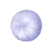       |
| 11400110   | 11400110NAME     |        |
| 11400120   | 11400120NAME     |        |
| 11400130   | 11400130NAME     |        |
| 11400140   | 11400140NAME     |        |
| 11400150   | 11400150NAME     |        |
| 11400160   | 11400160NAME     |        |
| 11401000   | 11401000NAME     |        |
| 11401001   | 11401001NAME     |        |
| 11401002   | 11401002NAME     |        |
| 11401003   | 11401003NAME     |        |
| 11401004   | 11401004NAME     |        |
| 11401005   | 11401005NAME     |        |
| 11401006   | 11401006NAME     |        |
| 11401007   | 11401007NAME     |        |
| 11401008   | 11401008NAME     |        |
| 11401009   | 11401009NAME     |        |
| 11401010   | 11401010NAME     |        |
| 11401020   | 11401020NAME     |        |
| 11401021   | 11401021NAME     |        |
| 11401022   | 11401022NAME     |        |
| 11401023   | 11401023NAME     |        |
| 11401024   | 11401024NAME     |        |
| 11401025   | 11401025NAME     |        |
| 11401026   | 11401026NAME     |        |
| 11401027   | 11401027NAME     |        |
| 11401028   | 11401028NAME     |        |
| 11401029   | 11401029NAME     |        |
| 11401030   | 11401030NAME     |        |
| 11401040   | 11401040NAME     |        |
| 11401041   | 11401041NAME     |        |
| 11401042   | 11401042NAME     |        |
| 11401043   | 11401043NAME     |        |
| 11401044   | 11401044NAME     |        |
| 11401045   | 11401045NAME     |        |
| 11401046   | 11401046NAME     |        |
| 11401047   | 11401047NAME     |        |
| 11401048   | 11401048NAME     |        |
| 11401049   | 11401049NAME     |        |
| 11401050   | 11401050NAME     |        |
| 11401060   | 11401060NAME     |        |
| 11401061   | 11401061NAME     |        |
| 11401062   | 11401062NAME     |        |
| 11401063   | 11401063NAME     |        |
| 11401064   | 11401064NAME     |        |
| 11401065   | 11401065NAME     |        |
| 11401066   | 11401066NAME     |        |
| 11401067   | 11401067NAME     |        |
| 11401068   | 11401068NAME     |        |
| 11401069   | 11401069NAME     |        |
| 11401070   | 11401070NAME     |        |
| 11401080   | 11401080NAME     |        |
| 11401081   | 11401081NAME     |        |
| 11401082   | 11401082NAME     |        |
| 11401083   | 11401083NAME     |        |
| 11401084   | 11401084NAME     |        |
| 11401085   | 11401085NAME     |        |
| 11401086   | 11401086NAME     |        |
| 11401087   | 11401087NAME     |        |
| 11401088   | 11401088NAME     |        |
| 11401089   | 11401089NAME     |        |
| 11401090   | 11401090NAME     |        |
| 11401100   | 11401100NAME     |        |
| 11401101   | 11401101NAME     |        |
| 11401102   | 11401102NAME     |        |
| 11401103   | 11401103NAME     |        |
| 11401104   | 11401104NAME     |        |
| 11401105   | 11401105NAME     |        |
| 11401106   | 11401106NAME     |        |
| 11401107   | 11401107NAME     |        |
| 11401108   | 11401108NAME     |        |
| 11401109   | 11401109NAME     |        |
| 11401110   | 11401110NAME     |        |
| 11401120   | 11401120NAME     |        |
| 11401121   | 11401121NAME     |        |
| 11401122   | 11401122NAME     |        |
| 11401123   | 11401123NAME     |        |
| 11401124   | 11401124NAME     |        |
| 11401125   | 11401125NAME     |        |
| 11401126   | 11401126NAME     |        |
| 11401127   | 11401127NAME     |        |
| 11401128   | 11401128NAME     |        |
| 11401129   | 11401129NAME     |        |
| 11401130   | 11401130NAME     |        |
| 11401140   | 11401140NAME     |        |
| 11401141   | 11401141NAME     |        |
| 11401142   | 11401142NAME     |        |
| 11401143   | 11401143NAME     |        |
| 11401144   | 11401144NAME     |        |
| 11401145   | 11401145NAME     |        |
| 11401146   | 11401146NAME     |        |
| 11401147   | 11401147NAME     |        |
| 11401148   | 11401148NAME     |        |
| 11401149   | 11401149NAME     |        |
| 11401150   | 11401150NAME     |        |
| 11401160   | 11401160NAME     |        |
| 11401161   | 11401161NAME     |        |
| 11401162   | 11401162NAME     |        |
| 11401163   | 11401163NAME     |        |
| 11401164   | 11401164NAME     |        |
| 11401165   | 11401165NAME     |        |
| 11401166   | 11401166NAME     |        |
| 11401167   | 11401167NAME     |        |
| 11401168   | 11401168NAME     |        |
| 11401169   | 11401169NAME     |        |
| 11401170   | 11401170NAME     |        |
| 11401180   | 11401180NAME     |        |
| 11401181   | 11401181NAME     |        |
| 11401182   | 11401182NAME     |        |
| 11401183   | 11401183NAME     |        |
| 11401184   | 11401184NAME     |        |
| 11401185   | 11401185NAME     |        |
| 11401186   | 11401186NAME     |        |
| 11401187   | 11401187NAME     |        |
| 11401188   | 11401188NAME     |        |
| 11401189   | 11401189NAME     |        |
| 11401190   | 11401190NAME     |        |
| 11401200   | 11401200NAME     |        |
| 11401201   | 11401201NAME     |        |
| 11401202   | 11401202NAME     |        |
| 11401203   | 11401203NAME     |        |
| 11401204   | 11401204NAME     |        |
| 11401205   | 11401205NAME     |        |
| 11401206   | 11401206NAME     |        |
| 11401207   | 11401207NAME     |        |
| 11401208   | 11401208NAME     |        |
| 11401209   | 11401209NAME     |        |
| 11401210   | 11401210NAME     |        |
| 11401220   | 11401220NAME     |        |
| 11401221   | 11401221NAME     |        |
| 11401222   | 11401222NAME     |        |
| 11401223   | 11401223NAME     |        |
| 11401224   | 11401224NAME     |        |
| 11401225   | 11401225NAME     |        |
| 11401226   | 11401226NAME     |        |
| 11401227   | 11401227NAME     |        |
| 11401228   | 11401228NAME     |        |
| 11401229   | 11401229NAME     |        |
| 11401230   | 11401230NAME     |        |
| 11401240   | 11401240NAME     |        |
| 11401241   | 11401241NAME     |        |
| 11401242   | 11401242NAME     |        |
| 11401243   | 11401243NAME     |        |
| 11401244   | 11401244NAME     |        |
| 11401245   | 11401245NAME     |        |
| 11401246   | 11401246NAME     |        |
| 11401247   | 11401247NAME     |        |
| 11401248   | 11401248NAME     |        |
| 11401249   | 11401249NAME     |        |
| 11401250   | 11401250NAME     |        |
| 11401260   | 11401260NAME     |        |
| 11401261   | 11401261NAME     |        |
| 11401262   | 11401262NAME     |        |
| 11401263   | 11401263NAME     |        |
| 11401264   | 11401264NAME     |        |
| 11401265   | 11401265NAME     |        |
| 11401266   | 11401266NAME     |        |
| 11401267   | 11401267NAME     |        |
| 11401268   | 11401268NAME     |        |
| 11401269   | 11401269NAME     |        |
| 11401270   | 11401270NAME     |        |
| 11401280   | 11401280NAME     |        |
| 11401281   | 11401281NAME     |        |
| 11401282   | 11401282NAME     |        |
| 11401283   | 11401283NAME     |        |
| 11401284   | 11401284NAME     |        |
| 11401285   | 11401285NAME     |        |
| 11401286   | 11401286NAME     |        |
| 11401287   | 11401287NAME     |        |
| 11401288   | 11401288NAME     |        |
| 11401289   | 11401289NAME     |        |
| 11401290   | 11401290NAME     |        |
| 11401300   | 11401300NAME     |        |
| 11401320   | 11401320NAME     |        |
| 11401340   | 11401340NAME     |        |
| 11401360   | 11401360NAME     |        |
| 11401380   | 11401380NAME     |        |
| 11401400   | 11401400NAME     |        |
| 11401420   | 11401420NAME     |        |
| 11401440   | 11401440NAME     |        |
| 11401460   | 11401460NAME     |        |
| 11401480   | 11401480NAME     |        |
| 11401500   | 11401500NAME     |        |
| 11401520   | 11401520NAME     |        |
| 11401540   | 11401540NAME     |        |
| 11401560   | 11401560NAME     |        |
| 11401580   | 11401580NAME     |        |
| 11401600   | 11401600NAME     |        |
| 11401620   | 11401620NAME     |        |
| 11401640   | 11401640NAME     |        |
| 11401660   | 11401660NAME     |        |
| 11500000   | 11500000NAME     |        |
| 11500010   | 11500010NAME     |        |
| 11500011   | 11500011NAME     |        |
| 11500012   | 11500012NAME     |        |
| 11500040   | 11500040NAME     |        |
| 11500050   | 11500050NAME     |        |
| 11500060   | 11500060NAME     |        |
| 11500070   | 11500070NAME     |        |
| 11500071   | 11500071NAME     |        |
| 11500080   | 11500080NAME     |        |
| 11500081   | 11500081NAME     |        |
| 11500090   | 11500090NAME     |        |
| 11500100   | 11500100NAME     |        |
| 11500101   | 11500101NAME     |        |
| 11500110   | 11500110NAME     |        |
| 11500130   | 11500130NAME     |        |
| 11500140   | 11500140NAME     |        |
| 11500150   | 11500150NAME     |        |
| 11600000   | 11600000NAME     |        |
| 11600010   | 11600010NAME     |        |
| 11600011   | 11600011NAME     |        |
| 11600020   | 11600020NAME     |        |
| 11600030   | 11600030NAME     |        |
| 11600050   | 11600050NAME     |        |
| 11600051   | 11600051NAME     |        |
| 11600052   | 11600052NAME     |        |
| 11600054   | 11600054NAME     |        |
| 11600060   | 11600060NAME     |        |
| 11600061   | 11600061NAME     |        |
| 11600070   | 11600070NAME     |        |
| 11600071   | 11600071NAME     |        |
| 11600080   | 11600080NAME     |        |
| 11600081   | 11600081NAME     |        |
| 11600090   | 11600090NAME     |        |
| 11600091   | 11600091NAME     |        |
| 11600100   | 11600100NAME     |        |
| 11600101   | 11600101NAME     |        |
| 11600102   | 11600102NAME     |        |
| 11600110   | 11600110NAME     |        |
| 11600130   | 11600130NAME     |        |
| 11600150   | 11600150NAME     |        |
| 11600170   | 11600170NAME     |        |
| 11600180   | 11600180NAME     |        |
| 11600190   | 11600190NAME     |        |
| 11600191   | 11600191NAME     |        |
| 11600192   | 11600192NAME     |        |
| 11600200   | 11600200NAME     |        |
| 11600201   | 11600201NAME     |        |
| 11600210   | 11600210NAME     |        |
| 11600211   | 11600211NAME     |        |
| 11600220   | 11600220NAME     |        |
| 11600221   | 11600221NAME     |        |
| 11600230   | 11600230NAME     |        |
| 11600240   | 11600240NAME     |        |
| 11600250   | 11600250NAME     |        |
| 11600260   | 11600260NAME     |        |
| 11700020   | 11700020NAME     |        |
| 11700021   | 11700021NAME     |        |
| 11700022   | 11700022NAME     |        |
| 11700023   | 11700023NAME     |        |
| 11700024   | 11700024NAME     |        |
| 11700030   | 11700030NAME     |        |
| 11700031   | 11700031NAME     |        |
| 11700032   | 11700032NAME     |        |
| 11700033   | 11700033NAME     |        |
| 11700034   | 11700034NAME     |        |
| 11700040   | 11700040NAME     |        |
| 11700050   | 11700050NAME     |        |
| 11700051   | 11700051NAME     |        |
| 11700052   | 11700052NAME     |        |
| 11700053   | 11700053NAME     |        |
| 11700060   | 11700060NAME     |        |
| 11700070   | 11700070NAME     |        |
| 11700080   | 11700080NAME     |        |
| 11700081   | 11700081NAME     |        |
| 11700090   | 11700090NAME     |        |
| 11700091   | 11700091NAME     |        |
| 11700100   | 11700100NAME     |        |
| 11700110   | 11700110NAME     | 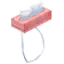       |
| 11700120   | 11700120NAME     |        |
| 11700130   | 11700130NAME     |        |
| 11700131   | 11700131NAME     |        |
| 11700140   | 11700140NAME     |        |
| 11700141   | 11700141NAME     |        |
| 11700150   | 11700150NAME     |        |
| 11700160   | 11700160NAME     |        |
| 11700170   | 11700170NAME     |        |
| 11700180   | 11700180NAME     |        |
| 11700190   | 11700190NAME     |        |
| 11700200   | 11700200NAME     |        |
| 11700201   | 11700201NAME     |        |
| 11700210   | 11700210NAME     |        |
| 11700211   | 11700211NAME     |        |
| 11700220   | 11700220NAME     |        |
| 11700221   | 11700221NAME     |        |
| 11700240   | 11700240NAME     |        |
| 11700241   | 11700241NAME     |        |
| 11700242   | 11700242NAME     |        |
| 11700243   | 11700243NAME     |        |
| 11700244   | 11700244NAME     |        |
| 11700245   | 11700245NAME     |        |
| 11700250   | 11700250NAME     |        |
| 11700251   | 11700251NAME     |        |
| 11700252   | 11700252NAME     |        |
| 11700260   | 11700260NAME     |        |
| 11700270   | 11700270NAME     |        |
| 11700280   | 11700280NAME     |        |
| 11700290   | 11700290NAME     |        |
| 11700300   | 11700300NAME     |        |
| 11700310   | 11700310NAME     |        |
| 11700320   | 11700320NAME     |        |
| 11700330   | 11700330NAME     |        |
| 11700331   | 11700331NAME     |        |
| 11700340   | 11700340NAME     |        |
| 11700350   | 11700350NAME     |        |
| 11700351   | 11700351NAME     |        |
| 11700360   | 11700360NAME     |        |
| 11700370   | 11700370NAME     |        |
| 11700380   | 11700380NAME     |        |
| 11700390   | 11700390NAME     |        |
| 11700391   | 11700391NAME     |        |
| 11800010   | 11800010NAME     |        |
| 11800011   | 11800011NAME     |        |
| 11800020   | 11800020NAME     |        |
| 11800021   | 11800021NAME     |        |
| 11800030   | 11800030NAME     |        |
| 11800031   | 11800031NAME     |        |
| 11800032   | 11800032NAME     |        |
| 11800040   | 11800040NAME     |        |
| 11800041   | 11800041NAME     |        |
| 11800042   | 11800042NAME     |        |
| 11800050   | 11800050NAME     |        |
| 11800051   | 11800051NAME     |        |
| 11800052   | 11800052NAME     |        |
| 12000000   | 12000000NAME     |        |
| 12000001   | 12000001NAME     |        |
| 12000002   | 12000002NAME     |        |
| 12000003   | 12000003NAME     |        |
| 12000004   | 12000004NAME     |        |
| 12000005   | 12000005NAME     |        |
| 12000010   | 12000010NAME     |        |
| 12000011   | 12000011NAME     |        |
| 12000012   | 12000012NAME     |        |
| 12000013   | 12000013NAME     |        |
| 12000014   | 12000014NAME     |        |
| 12000017   | 12000017NAME     |        |
| 12000018   | 12000018NAME     |        |
| 12000020   | 12000020NAME     |        |
| 12000021   | 12000021NAME     |        |
| 12000022   | 12000022NAME     |        |
| 12000023   | 12000023NAME     |        |
| 12000024   | 12000024NAME     |        |
| 12000025   | 12000025NAME     |        |
| 12000030   | 12000030NAME     |        |
| 12000031   | 12000031NAME     |        |
| 12000032   | 12000032NAME     |        |
| 12000033   | 12000033NAME     |        |
| 12000040   | 12000040NAME     |        |
| 12000041   | 12000041NAME     |        |
| 12000042   | 12000042NAME     |        |
| 12000043   | 12000043NAME     |        |
| 12000050   | 12000050NAME     |        |
| 12000051   | 12000051NAME     |        |
| 12000052   | 12000052NAME     |        |
| 12000053   | 12000053NAME     |        |
| 12000060   | 12000060NAME     |        |
| 12000061   | 12000061NAME     |        |
| 12000062   | 12000062NAME     |        |
| 12000070   | 12000070NAME     |        |
| 12000071   | 12000071NAME     |        |
| 12000072   | 12000072NAME     |        |
| 12000075   | 12000075NAME     |        |
| 12000076   | 12000076NAME     |        |
| 12001000   | 12001000NAME     |        |
| 12001001   | 12001001NAME     |        |
| 12001002   | 12001002NAME     |        |
| 12001003   | 12001003NAME     |        |
| 12001004   | 12001004NAME     |        |
| 12001005   | 12001005NAME     |        |
| 12001006   | 12001006NAME     |        |
| 12001007   | 12001007NAME     |        |
| 12001008   | 12001008NAME     |        |
| 12001010   | 12001010NAME     |        |
| 12001011   | 12001011NAME     |        |
| 12001012   | 12001012NAME     |        |
| 12001013   | 12001013NAME     |        |
| 12001014   | 12001014NAME     |        |
| 12001015   | 12001015NAME     |        |
| 12001016   | 12001016NAME     |        |
| 12001017   | 12001017NAME     |        |
| 12001018   | 12001018NAME     |        |
| 12001020   | 12001020NAME     |        |
| 12001021   | 12001021NAME     |        |
| 12001022   | 12001022NAME     |        |
| 12001023   | 12001023NAME     |        |
| 12001024   | 12001024NAME     |        |
| 12001025   | 12001025NAME     |        |
| 12001026   | 12001026NAME     |        |
| 12001027   | 12001027NAME     |        |
| 12001028   | 12001028NAME     |        |
| 12001030   | 12001030NAME     |        |
| 12001031   | 12001031NAME     |        |
| 12001032   | 12001032NAME     |        |
| 12001033   | 12001033NAME     |        |
| 12001034   | 12001034NAME     |        |
| 12001035   | 12001035NAME     |        |
| 12001036   | 12001036NAME     |        |
| 12001037   | 12001037NAME     |        |
| 12001038   | 12001038NAME     |        |
| 12001040   | 12001040NAME     |        |
| 12001041   | 12001041NAME     |        |
| 12001042   | 12001042NAME     |        |
| 12001043   | 12001043NAME     |        |
| 12001044   | 12001044NAME     |        |
| 12001045   | 12001045NAME     |        |
| 12001046   | 12001046NAME     |        |
| 12001047   | 12001047NAME     |        |
| 12001048   | 12001048NAME     |        |
| 12001060   | 12001060NAME     |        |
| 12001061   | 12001061NAME     |        |
| 12001062   | 12001062NAME     |        |
| 12001063   | 12001063NAME     |        |
| 12001064   | 12001064NAME     |        |
| 12001065   | 12001065NAME     |        |
| 12001066   | 12001066NAME     |        |
| 12001067   | 12001067NAME     |        |
| 12001070   | 12001070NAME     |        |
| 12001071   | 12001071NAME     |        |
| 12001072   | 12001072NAME     |        |
| 12001073   | 12001073NAME     |        |
| 12001074   | 12001074NAME     |        |
| 12001075   | 12001075NAME     |        |
| 12001076   | 12001076NAME     |        |
| 12001077   | 12001077NAME     |        |
| 12001080   | 12001080NAME     |        |
| 12001081   | 12001081NAME     |        |
| 12001082   | 12001082NAME     |        |
| 12001083   | 12001083NAME     |        |
| 12001084   | 12001084NAME     |        |
| 12001085   | 12001085NAME     |        |
| 12001086   | 12001086NAME     |        |
| 12001087   | 12001087NAME     |        |
| 12001090   | 12001090NAME     |        |
| 12001091   | 12001091NAME     |        |
| 12001092   | 12001092NAME     |        |
| 12001093   | 12001093NAME     |        |
| 12001094   | 12001094NAME     |        |
| 12001095   | 12001095NAME     |        |
| 12001096   | 12001096NAME     |        |
| 12001097   | 12001097NAME     |        |
| 12002000   | 12002000NAME     |        |
| 12002001   | 12002001NAME     |        |
| 12002002   | 12002002NAME     |        |
| 12002010   | 12002010NAME     |        |
| 12002011   | 12002011NAME     |        |
| 12002012   | 12002012NAME     |        |
| 12002020   | 12002020NAME     |        |
| 12002021   | 12002021NAME     |        |
| 12002022   | 12002022NAME     |        |
| 12002030   | 12002030NAME     |        |
| 12002031   | 12002031NAME     |        |
| 12002032   | 12002032NAME     |        |
| 12002060   | 12002060NAME     |        |
| 12002061   | 12002061NAME     |        |
| 12002062   | 12002062NAME     |        |
| 12002070   | 12002070NAME     |        |
| 12002071   | 12002071NAME     |        |
| 12002072   | 12002072NAME     |        |
| 12003000   | 12003000NAME     |        |
| 12003010   | 12003010NAME     |        |
| 12003020   | 12003020NAME     |        |
| 12003030   | 12003030NAME     |        |
| 12003040   | 12003040NAME     |        |
| 12003050   | 12003050NAME     |        |
| 12003060   | 12003060NAME     |        |
| 12003070   | 12003070NAME     |        |
| 12003080   | 12003080NAME     |        |
| 12004000   | 12004000NAME     |        |
| 12004010   | 12004010NAME     |        |
| 12004020   | 12004020NAME     |        |
| 12004030   | 12004030NAME     |        |
| 12004040   | 12004040NAME     |        |
| 12004050   | 12004050NAME     |        |
| 12004060   | 12004060NAME     |        |
| 12004070   | 12004070NAME     |        |
| 12004080   | 12004080NAME     |        |
| 12004090   | 12004090NAME     |        |
| 12004100   | 12004100NAME     |        |
| 12004110   | 12004110NAME     |        |
| 12004120   | 12004120NAME     |        |
| 12004130   | 12004130NAME     |        |
| 12004140   | 12004140NAME     |        |
| 12004150   | 12004150NAME     |        |
| 12004160   | 12004160NAME     |        |
| 12004170   | 12004170NAME     |        |
| 12004180   | 12004180NAME     |        |
| 12004190   | 12004190NAME     |        |
| 12004200   | 12004200NAME     |        |
| 12004210   | 12004210NAME     |        |
| 12004220   | 12004220NAME     |        |
| 12004230   | 12004230NAME     |        |
| 12004240   | 12004240NAME     |        |
| 12004250   | 12004250NAME     |        |
| 12004260   | 12004260NAME     |        |
| 12004270   | 12004270NAME     |        |
| 12004280   | 12004280NAME     |        |
| 12004290   | 12004290NAME     |        |
| 12004300   | 12004300NAME     |        |
| 12004310   | 12004310NAME     |        |
| 12004320   | 12004320NAME     |        |
| 12004330   | 12004330NAME     |        |
| 12004340   | 12004340NAME     |        |
| 12004350   | 12004350NAME     |        |
| 12004360   | 12004360NAME     |        |
| 12004370   | 12004370NAME     |        |
| 12004380   | 12004380NAME     |        |
| 12004390   | 12004390NAME     |        |
| 12004400   | 12004400NAME     |        |
| 12004410   | 12004410NAME     |        |
| 12004420   | 12004420NAME     |        |
| 12004430   | 12004430NAME     |        |
| 12004440   | 12004440NAME     |        |
| 12004450   | 12004450NAME     |        |
| 12004460   | 12004460NAME     |        |
| 12004470   | 12004470NAME     |        |
| 12004480   | 12004480NAME     |        |
| 12004490   | 12004490NAME     |        |
| 12004500   | 12004500NAME     |        |
| 12004510   | 12004510NAME     |        |
| 12004520   | 12004520NAME     |        |
| 12004530   | 12004530NAME     |        |
| 12004540   | 12004540NAME     |        |
| 12004550   | 12004550NAME     |        |
| 12004560   | 12004560NAME     |        |
| 12004570   | 12004570NAME     |        |
| 12004580   | 12004580NAME     |        |
| 12004590   | 12004590NAME     |        |
| 12004600   | 12004600NAME     |        |
| 12004610   | 12004610NAME     |        |
| 12004620   | 12004620NAME     | 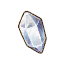       |
| 12004630   | 12004630NAME     |        |
| 12004640   | 12004640NAME     |        |
| 12200000   | 12200000NAME     |        |
| 12200001   | 12200001NAME     |        |
| 12200002   | 12200002NAME     |        |
| 12200010   | 12200010NAME     |        |
| 12200011   | 12200011NAME     |        |
| 12200020   | 12200020NAME     |        |
| 12200021   | 12200021NAME     |        |
| 12200030   | 12200030NAME     |        |
| 12200040   | 12200040NAME     |        |
| 12200050   | 12200050NAME     |        |
| 12200060   | 12200060NAME     |        |
| 12200061   | 12200061NAME     |        |
| 12200070   | 12200070NAME     |        |
| 12200080   | 12200080NAME     |        |
| 12200100   | 12200100NAME     |        |
| 12200110   | 12200110NAME     |        |
| 12200111   | 12200111NAME     |        |
| 12200112   | 12200112NAME     |        |
| 12200120   | 12200120NAME     |        |
| 12200121   | 12200121NAME     |        |
| 12200122   | 12200122NAME     |        |
| 12200130   | 12200130NAME     |        |
| 12200140   | 12200140NAME     |        |
| 12200141   | 12200141NAME     |        |
| 12200142   | 12200142NAME     |        |
| 12200150   | 12200150NAME     |        |
| 12200160   | 12200160NAME     |        |
| 12200171   | 12200171NAME     |        |
| 12200172   | 12200172NAME     |        |
| 12200173   | 12200173NAME     |        |
| 12200174   | 12200174NAME     |        |
| 12200175   | 12200175NAME     |        |
| 12200176   | 12200176NAME     |        |
| 12200180   | 12200180NAME     |        |
| 12200200   | 12200200NAME     |        |
| 12200210   | 12200210NAME     |        |
| 12200220   | 12200220NAME     |        |
| 12200221   | 12200221NAME     |        |
| 12200230   | 12200230NAME     |        |
| 12200231   | 12200231NAME     |        |
| 12200240   | 12200240NAME     |        |
| 12200250   | 12200250NAME     |        |
| 12200251   | 12200251NAME     |        |
| 12200252   | 12200252NAME     |        |
| 12200253   | 12200253NAME     |        |
| 12200254   | 12200254NAME     |        |
| 12200255   | 12200255NAME     |        |
| 12200256   | 12200256NAME     |        |
| 12200257   | 12200257NAME     |        |
| 12200258   | 12200258NAME     |        |
| 12200280   | 12200280NAME     |        |
| 12200281   | 12200281NAME     |        |
| 12200290   | 12200290NAME     |        |
| 12200300   | 12200300NAME     |        |
| 12200310   | 12200310NAME     |        |
| 12300000   | 12300000NAME     |        |
| 12300001   | 12300001NAME     |        |
| 12300010   | 12300010NAME     |        |
| 12300020   | 12300020NAME     |        |
| 12300021   | 12300021NAME     |        |
| 12300040   | 12300040NAME     |        |
| 12300041   | 12300041NAME     |        |
| 12300042   | 12300042NAME     |        |
| 12300043   | 12300043NAME     |        |
| 12300050   | 12300050NAME     |        |
| 12300051   | 12300051NAME     |        |
| 12300052   | 12300052NAME     |        |
| 14100000   | 14100000NAME     |        |
| 14100001   | 14100001NAME     |        |
| 14100002   | 14100002NAME     |        |
| 14100003   | 14100003NAME     |        |
| 14100004   | 14100004NAME     |        |
| 14100005   | 14100005NAME     |        |
| 14100006   | 14100006NAME     |        |
| 14100007   | 14100007NAME     |        |
| 14100008   | 14100008NAME     |        |
| 14100009   | 14100009NAME     |        |
| 14100010   | 14100010NAME     |        |
| 14100011   | 14100011NAME     |        |
| 14200000   | 14200000NAME     |        |
| 14200001   | 14200001NAME     |        |
| 14200002   | 14200002NAME     |        |
| 14200003   | 14200003NAME     |        |
| 14200004   | 14200004NAME     |        |
| 14200005   | 14200005NAME     |        |
| 14200006   | 14200006NAME     |        |
| 14200007   | 14200007NAME     |        |
| 14200008   | 14200008NAME     |        |
| 14200009   | 14200009NAME     |        |
| 14200010   | 14200010NAME     |        |
| 14200011   | 14200011NAME     |        |
| 14300000   | 14300000NAME     |        |
| 14300001   | 14300001NAME     |        |
| 14300002   | 14300002NAME     |        |
| 14300003   | 14300003NAME     |        |
| 20000033   | 20000033NAME     |        |
| 20000034   | 20000034NAME     |        |
| 20000035   | 20000035NAME     |        |
| 20000100   | 20000100NAME     |        |
| 20000101   | 20000101NAME     |        |
| 20000102   | 20000102NAME     |        |
| 20000103   | 20000103NAME     |        |
| 20000104   | 20000104NAME     |        |
| 20000105   | 20000105NAME     |        |
| 20000106   | 20000106NAME     |        |
| 20000107   | 20000107NAME     |        |
| 20000108   | 20000108NAME     |        |
| 20000109   | 20000109NAME     |        |
| 20000110   | 20000110NAME     |        |
| 20000111   | 20000111NAME     |        |
| 20000112   | 20000112NAME     |        |
| 20000113   | 20000113NAME     |        |
| 20000114   | 20000114NAME     |        |
| 20000115   | 20000115NAME     |        |
| 20000116   | 20000116NAME     |        |
| 20000117   | 20000117NAME     |        |
| 20000132   | 20000132NAME     |        |
| 20000133   | 20000133NAME     |        |
| 20000134   | 20000134NAME     |        |
| 20000135   | 20000135NAME     |        |
| 20000137   | 20000137NAME     |        |
| 20000152   | 20000152NAME     |        |
| 20000153   | 20000153NAME     |        |
| 20000154   | 20000154NAME     |        |
| 20000155   | 20000155NAME     |        |
| 20000156   | 20000156NAME     |        |
| 20000157   | 20000157NAME     |        |
| 20000158   | 20000158NAME     |        |
| 20000166   | 20000166NAME     |        |
| 20000167   | 20000167NAME     |        |
| 20000168   | 20000168NAME     |        |
| 20000169   | 20000169NAME     |        |
| 20000170   | 20000170NAME     |        |
| 20000171   | 20000171NAME     |        |
| 20000172   | 20000172NAME     |        |
| 20000173   | 20000173NAME     |        |
| 20000174   | 20000174NAME     |        |
| 20000175   | 20000175NAME     |        |
| 20000176   | 20000176NAME     |        |
| 20000177   | 20000177NAME     |        |
| 20000185   | 20000185NAME     |        |
| 20000186   | 20000186NAME     |        |
| 20000187   | 20000187NAME     |        |
| 20000188   | 20000188NAME     |        |
| 20000189   | 20000189NAME     |        |
| 20000190   | 20000190NAME     |        |
| 20000191   | 20000191NAME     |        |
| 20000193   | 20000193NAME     |        |
| 20000198   | 20000198NAME     |        |
| 20000213   | 20000213NAME     |        |
| 20000214   | 20000214NAME     |        |
| 20000215   | 20000215NAME     |        |
| 20000216   | 20000216NAME     |        |
| 20000217   | 20000217NAME     |        |
| 20000218   | 20000218NAME     |        |
| 20000223   | 20000223NAME     |        |
| 20000229   | 20000229NAME     |        |
| 20000231   | 20000231NAME     |        |
| 20000234   | 20000234NAME     |        |
| 20000249   | 20000249NAME     |        |
| 30000000   | 30000000NAME     |        |
| 30000001   | 30000001NAME     |        |
| 30000002   | 30000002NAME     |        |
| 30000003   | 30000003NAME     |        |
| 30000004   | 30000004NAME     |        |
| 30000005   | 30000005NAME     |        |
| 30000006   | 30000006NAME     |        |
| 30000007   | 30000007NAME     |        |
| 30000008   | 30000008NAME     |        |
| 30000009   | 30000009NAME     |        |
| 30000010   | 30000010NAME     |        |
| 30000011   | 30000011NAME     |        |
| 30000012   | 30000012NAME     |        |
| 30000013   | 30000013NAME     |        |
| 30000014   | 30000014NAME     |        |
| 30000015   | 30000015NAME     |        |
| 30000016   | 30000016NAME     |        |
| 30000017   | 30000017NAME     |        |
| 30000018   | 30000018NAME     |        |
| 40100000   | 40100000NAME     |        |
| 40100010   | 40100010NAME     |        |
| 40100020   | 40100020NAME     |        |
| 40100030   | 40100030NAME     |        |
| 40100060   | 40100060NAME     |        |
| 40100070   | 40100070NAME     |        |
| 40100080   | 40100080NAME     |        |
| 40100120   | 40100120NAME     |        |
| 40100120_2 | 40100120_2NAME   |      |
| 40100130   | 40100130NAME     |        |
| 40100140   | 40100140NAME     |        |
| 40100150   | 40100150NAME     |        |
| 40100160   | 40100160NAME     |        |
| 40100170   | 40100170NAME     |        |
| 40100180   | 40100180NAME     |        |
| 40100190   | 40100190NAME     |        |
| 40100200   | 40100200NAME     |        |
| 40100210   | 40100210NAME     |        |
| 40100220   | 40100220NAME     |        |
| 40100230   | 40100230NAME     |        |
| 40100240   | 40100240NAME     |        |
| 40100250   | 40100250NAME     |        |
| 40100260   | 40100260NAME     |        |
| 40100270   | 40100270NAME     |        |
| 40100280   | 40100280NAME     |        |
| 40100290   | 40100290NAME     |        |
| 40100300   | 40100300NAME     |        |
| 40100310   | 40100310NAME     |        |
| 40100320   | 40100320NAME     |        |
| 40100330   | 40100330NAME     |        |
| 40100340   | 40100340NAME     |        |
| 40100350   | 40100350NAME     |        |
| 40100360   | 40100360NAME     |        |
| 40100370   | 40100370NAME     |        |
| 40100380   | 40100380NAME     |        |
| 40100390   | 40100390NAME     |        |
| 40100400   | 40100400NAME     |        |
| 40100410   | 40100410NAME     |        |
| 40100420   | 40100420NAME     |        |
| 40100430   | 40100430NAME     |        |
| 40100440   | 40100440NAME     |        |
| 40100450   | 40100450NAME     |        |
| 40200000   | 40200000NAME     |        |
| 40200010   | 40200010NAME     |        |
| 40200011   | 40200011NAME     |        |
| 40200020   | 40200020NAME     |        |
| 40200030   | 40200030NAME     |        |
| 40200050   | 40200050NAME     |        |
| 40200070   | 40200070NAME     |        |
| 40200070_2 | 40200070_2NAME   |      |
| 40200080   | 40200080NAME     |        |
| 40200090   | 40200090NAME     |        |
| 40200100   | 40200100NAME     |        |
| 40200110   | 40200110NAME     |        |
| 40300000   | 40300000NAME     |        |
| 40300010   | 40300010NAME     |        |
| 40300030   | 40300030NAME     |        |
| 40300040   | 40300040NAME     |        |
| 40400000   | 40400000NAME     |        |
| 40400010   | 40400010NAME     |        |
| 40500000   | 40500000NAME     |        |
| 40500030   | 40500030NAME     |        |
| 40500040   | 40500040NAME     |        |
| 40500060   | 40500060NAME     |        |
| 40500070   | 40500070NAME     |        |
| 40500080   | 40500080NAME     |        |
| 40500090   | 40500090NAME     |        |
| 40500100   | 40500100NAME     |        |
| 40500110   | 40500110NAME     |        |
| 40500120   | 40500120NAME     |        |
| 40500130   | 40500130NAME     |        |
| 40500140   | 40500140NAME     |        |
| 40500150   | 40500150NAME     |        |
| 40600010   | 40600010NAME     |        |
| 40600011   | 40600011NAME     |        |
| 40600020   | 40600020NAME     |        |
| 40600030   | 40600030NAME     |        |
| 40700010   | 40700010NAME     |        |
| 40700011   | 40700011NAME     |        |
| 40700020   | 40700020NAME     |        |
| 40700040   | 40700040NAME     |        |
| 40900000   | 40900000NAME     |        |
| 40900010   | 40900010NAME     |        |
| 41000000   | 41000000NAME     |        |
| 41000001   | 41000001NAME     |        |
| 41000002   | 41000002NAME     |        |
| 41000003   | 41000003NAME     |        |
| 41000100   | 41000100NAME     |        |
| 41000101   | 41000101NAME     |        |
| 41400000   | 41400000NAME     |        |
| 42200010   | 42200010NAME     |        |
| 42200020   | 42200020NAME     |        |
| 99999999   | 99999999NAME     |        |