| ID | Name(Japanese) | Icon |
| --- | --- | --- |
| 1 | Unknown |  |
| 10000000 | バーベナ学園女子帽子 |  |
| 10000010 | 秋色キャスケット(ピンク) |  |
| 10000011 | 秋色キャスケット(グレー) |  |
| 10000012 | 秋色キャスケット(ベージュ) |  |
| 10000013 | 秋色キャスケット(紺) |  |
| 10000020 | 迷彩キャップ(カーキー) |  |
| 10000021 | 迷彩キャップ(サンド) |  |
| 10000022 | 迷彩キャップ(モノクロ) |  |
| 10000030 | ステッチニット帽(白) |  |
| 10000031 | ステッチニット帽(黒) |  |
| 10000032 | ステッチニット帽(ネイビー) |  |
| 10000033 | ステッチニット帽(緑) |  |
| 10000034 | ステッチニット帽(ベージュ) |  |
| 10000040 | 見習い魔女のとんがり帽子♀ |  |
| 10000050 | 根性のドカヘル♂ |  |
| 10000060 | 野球帽(黒) |  |
| 10000061 | 野球帽(青) |  |
| 10000062 | 野球帽(黄) |  |
| 10000063 | 野球帽(赤) |  |
| 10000064 | 野球帽(緑) |  |
| 10000070 | 魔女の帽子(黒) |  |
| 10000071 | 魔女の帽子(オレンジ) |  |
| 10000072 | 魔女の帽子(黄) |  |
| 10000080 | 駅員帽子 |  |
| 10000090 | メリーメリー帽(赤白) |  |
| 10000091 | メリーメリー帽(白白) |  |
| 10000100 | ポンポンニット帽(緑) |  |
| 10000101 | ポンポンニット帽(赤) |  |
| 10000102 | ポンポンニット帽(白) |  |
| 10000110 | お嬢様のベレー帽(黒)・未公開? |  |
| 10000111 | お嬢様のベレー帽(ワイン) |  |
| 10000112 | Unknown |  |
| 10000120 | マッドモンスターキャップ(黒)♀ |  |
| 10000121 | マッドモンスターキャップ(白)♀ |  |
| 10000130 | 渚とお揃いの白い帽子♀ |  |
| 10000140 | 不明 |  |
| 10000150 | かなでとお揃いの帽子♀ |  |
| 10000160 | 美空学園帽子♀ |  |
| 10000170 | 不明 |  |
| 10000180 | 不明 |  |
| 10000181 | Unknown |  |
| 10000190 | Unknown |  |
| 10000200 | Unknown |  |
| 10000210 | Unknown |  |
| 10000220 | Unknown |  |
| 10000221 | Unknown |  |
| 10000230 | Unknown |  |
| 10000240 | Unknown |  |
| 10000250 | Unknown |  |
| 10000260 | Unknown |  |
| 10000261 | Unknown |  |
| 10000270 | Unknown |  |
| 10000280 | Unknown |  |
| 10100000 | 風見学園本校・女子ワンピース♀ |  |
| 10100010 | 光坂高校三年・女子制服♀ |  |
| 10100011 | 光坂高校一年・女子制服♀ |  |
| 10100012 | 光坂高校二年・女子制服♀ | 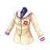 |
| 10100020 | バーベナ学園・女子制服♀ |  |
| 10100030 | 無地のカーディガン(灰) |  |
| 10100031 | 無地のカーディガン(赤) |  |
| 10100032 | 無地のカーディガン(水) |  |
| 10100033 | 無地のカーディガン(黄) |  |
| 10100034 | 無地のカーディガン(黒) |  |
| 10100035 | 無地のカーディガン(紺) |  |
| 10100036 | 無地のカーディガン(白) |  |
| 10100050 | レースキャミソール(黒) |  |
| 10100051 | レースキャミソール(茶) |  |
| 10100052 | レースキャミソール(水色) |  |
| 10100053 | レースキャミソール(黄) |  |
| 10100054 | レースキャミソール(白) |  |
| 10100060 | ai sp@ceＴシャツ(ピンク) |  |
| 10100061 | ai sp@ceＴシャツ(青) |  |
| 10100062 | ai sp@ceＴシャツ(黄) |  |
| 10100063 | ai sp@ceＴシャツ(赤) |  |
| 10100064 | ai sp@ceＴシャツ(緑) |  |
| 10100065 | ai sp@ceＴシャツ(白) |  |
| 10100066 | ai sp@ceＴシャツ(黒) |  |
| 10100070 | エアリーチューブ(ピンク) |  |
| 10100071 | エアリーチューブ(赤) |  |
| 10100072 | エアリーチューブ(水色) |  |
| 10100073 | エアリーチューブ(黄) |  |
| 10100080 | 巫女装束(赤)♀ |  |
| 10100081 | 巫女装束(パープル)♀ |  |
| 10100082 | 巫女装束(ネイビー)♀ |  |
| 10100083 | 巫女装束(ピンク)♀ |  |
| 10100090 | 梅柄チャイナドレス(青) |  |
| 10100091 | 梅柄チャイナドレス(赤) |  |
| 10100092 | 梅柄チャイナドレス(白) |  |
| 10100093 | 桜のチャイナドレス♀ |  |
| 10100094 | Unknown |  |
| 10100100 | ナース服(ピンク)・NPC専用 |  |
| 10100101 | ナース服(白)・未公開 |  |
| 10100102 | ナース服(黒)・未公開 |  |
| 10100110 | 大和撫子(黒)♀ |  |
| 10100111 | 大和撫子(赤)♀ |  |
| 10100112 | 大和撫子(ブルー)♀ |  |
| 10100113 | 大和撫子(黄)♀ |  |
| 10100114 | Unknown |  |
| 10100115 | Unknown |  |
| 10100120 | ヴィクトリアンメイド(黒) |  |
| 10100121 | ヴィクトリアンメイド(真紅) |  |
| 10100122 | ヴィクトリアンメイド(ブルー) |  |
| 10100123 | ヴィクトリアンメイド(黄) |  |
| 10100130 | 風見学園付属二年・女子制服♀ |  |
| 10100131 | 風見学園付属一年・女子制服♀ |  |
| 10100132 | 風見学園付属三年・女子制服♀ |  |
| 10100135 | R風見学園付属二年・女子制服♀ |  |
| 10100136 | R風見学園付属一年・女子制服♀ |  |
| 10100137 | R風見学園付属二年・女子制服♀ |  |
| 10100138 | R風見学園付属一年・女子制服♀ |  |
| 10100139 | Unknown |  |
| 10100140 | (男性用アイテム) |  |
| 10100141 | (男性用アイテム) |  |
| 10100142 | (男性用アイテム) |  |
| 10100143 | (男性用アイテム) |  |
| 10100144 | (男性用アイテム) |  |
| 10100160 | (男性用アイテム) |  |
| 10100161 | (男性用アイテム) |  |
| 10100162 | (男性用アイテム) | 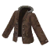 |
| 10100170 | (男性用アイテム) |  |
| 10100171 | (男性用アイテム) |  |
| 10100172 | (男性用アイテム) |  |
| 10100173 | (男性用アイテム) |  |
| 10100174 | Unknown |  |
| 10100175 | Unknown |  |
| 10100180 | (男性用アイテム) |  |
| 10100190 | (男性用アイテム) |  |
| 10100191 | (男性用アイテム) |  |
| 10100192 | (男性用アイテム) |  |
| 10100200 | ファーダウンベスト♀(白) |  |
| 10100201 | ファーダウンベスト♀(水色) |  |
| 10100202 | ファーダウンベスト♀(カーキ) |  |
| 10100203 | ファーダウンベスト♀(黒) |  |
| 10100210 | (男性用アイテム) |  |
| 10100211 | (男性用アイテム) |  |
| 10100212 | (男性用アイテム) |  |
| 10100220 | (男性用アイテム) |  |
| 10100221 | (男性用アイテム) |  |
| 10100222 | (男性用アイテム) |  |
| 10100223 | (男性用アイテム) |  |
| 10100224 | (男性用アイテム) |  |
| 10100225 | (男性用アイテム) |  |
| 10100226 | (男性用アイテム) |  |
| 10100250 | (男性用アイテム) |  |
| 10100251 | (男性用アイテム) |  |
| 10100252 | (男性用アイテム) |  |
| 10100260 | 風見学園本校・女子ジャケット♀ |  |
| 10100270 | (男性用アイテム) |  |
| 10100280 | (男性用アイテム) |  |
| 10100281 | (男性用アイテム) |  |
| 10100282 | (男性用アイテム) |  |
| 10100300 | (男性用アイテム) |  |
| 10100310 | 黒コート♂ |  |
| 10100320 | 女性用シャツ紫色 |  |
| 10100340 | 外神田ショップエプロン |  |
| 10100341 | 調理部のエプロン(ひよこ) |  |
| 10100342 | 調理部のエプロン(おはな) |  |
| 10100370 | 科学部の白衣(ホワイト)♀ |  |
| 10100380 | 教師のスーツ(紫) |  |
| 10100381 | 教師のスーツ(ピンク) |  |
| 10100385 | Unknown |  |
| 10100386 | Unknown |  |
| 10100390 | フォーマルブラウス(白)♀ |  |
| 10100391 | フォーマルブラウス(ピンク)♀ |  |
| 10100392 | フォーマルブラウス(グレー)♀ |  |
| 10100393 | フォーマルブラウス(ベージュ)♀ |  |
| 10100394 | Unknown |  |
| 10100395 | Unknown |  |
| 10100400 | チノツナギ(カーキ)♂ |  |
| 10100410 | ピュアニット(黄)♀ |  |
| 10100411 | ピュアニット(白)♀ |  |
| 10100412 | ピュアニット(青)♀ |  |
| 10100420 | バニーガール(黒) | 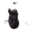 |
| 10100421 | バニーガール(白) 表示不可? |  |
| 10100422 | バニーガール(黄) 表示不可? |  |
| 10100423 | バニーガール(ピンク) 表示不可? | 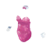 |
| 10100424 | バニーガール(赤) 表示不可? |  |
| 10100425 | バニーガール(青) 表示不可? |  |
| 10100430 | エプロン(青) 表示不可? |  |
| 10100440 | (男性用アイテム) |  |
| 10100450 | タートルセーター♂(黒) |  |
| 10100451 | タートルセーター♂(グレー) |  |
| 10100452 | タートルセーター♂(白) |  |
| 10100460 | パンクスカルTシャツ♂(黒) |  |
| 10100461 | パンクスカルTシャツ♂(白) |  |
| 10100470 | ななかとお揃いのセーター♀ |  |
| 10100480 | 船乗りのダッフルコート♀(青緑) |  |
| 10100481 | 船乗りのダッフルコート♀(モカ) |  |
| 10100482 | 船乗りのダッフルコート♀(白) |  |
| 10100483 | 船乗りのダッフルコート♀(黒) |  |
| 10100500 | いたずら魔女ドレス(オレンジ) |  |
| 10100501 | いたずら魔女ドレス(赤) |  |
| 10100503 | いたずら魔女ドレス(黄) |  |
| 10100510 | エンタま君Tシャツ♂ |  |
| 10100520 | エンタま君Tシャツ♀ |  |
| 10100530 | タートルセーター♀(黒) |  |
| 10100531 | タートルセーター♀(ピンク) |  |
| 10100532 | タートルセーター♀(白) |  |
| 10100540 | パンクスカルTシャツ(白) |  |
| 10100541 | パンクスカルTシャツ(黒) |  |
| 10100550 | メリーメリードレス(赤白)♀ |  |
| 10100551 | メリーメリードレス(白白)♀ |  |
| 10100570 | ai sp@ceセット |  |
| 10100571 | Unknown |  |
| 10100580 | 木漏れ日のワンピース(赤) |  |
| 10100581 | 木漏れ日のワンピース(紺) |  |
| 10100582 | 木漏れ日のワンピース(茶) |  |
| 10100590 | コンプティークTシャツ♂ |  |
| 10100591 | D.C.II P.C.記念Tシャツ♂ |  |
| 10100592 | Unknown |  |
| 10100600 | コンプティークTシャツ♀ |  |
| 10100601 | D.C.II P.C.記念Tシャツ♀ |  |
| 10100602 | Unknown |  |
| 10100610 | 振袖(緑)♀ |  |
| 10100611 | 振袖(赤)♀ |  |
| 10100620 | ガーリーニットワンピ(白)♀ |  |
| 10100621 | ガーリーニットワンピ(水色)♀ |  |
| 10100622 | ガーリーニットワンピ(ピンク)♀ |  |
| 10100623 | ガーリーニットワンピ(紺)♀ |  |
| 10100630 | アーガイルセーター(紺)♀ | 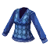 |
| 10100631 | アーガイルセーター(グレー)♀ |  |
| 10100632 | Unknown |  |
| 10100633 | Unknown |  |
| 10100640 | ゴスロリワルツコート♀(ピンク) |  |
| 10100641 | ゴスロリワルツコート♀(黒) |  |
| 10100643 | Unknown |  |
| 10100650 | ヴァイストップス♀ |  |
| 10100651 | シュヴァルツトップス♀ |  |
| 10100660 | パンクフリルシャツ(黒)♀ |  |
| 10100661 | パンクフリルシャツ(白)♀ |  |
| 10100670 | お嬢様のリボンブラウス(白)♀・未公開? |  |
| 10100671 | お嬢様のリボンブラウス(黒)♀ |  |
| 10100672 | Unknown |  |
| 10100680 | ジャージ・ボーイ♂(黒) |  |
| 10100681 | ジャージ・ボーイ♂(赤) |  |
| 10100682 | ジャージ・ボーイ♂(青) |  |
| 10100683 | ジャージ・ボーイ♂(黄) |  |
| 10100684 | ジャージ・ボーイ♂(白) |  |
| 10100690 | ジャージ・ガール♀(黒) |  |
| 10100691 | ジャージ・ガール♀(赤) |  |
| 10100692 | ジャージ・ガール♀(青) |  |
| 10100693 | ジャージ・ガール♀(黄) |  |
| 10100694 | ジャージ・ガール♀(白) |  |
| 10100700 | ななかとお揃いのジャージ♀ |  |
| 10100710 | 喫茶フローラ制服♀ |  |
| 10100720 | シアとお揃いのニット(ピンク)♀ | 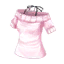 |
| 10100721 | シアとお揃いのニット(水色)♀ |  |
| 10100730 | シアとお揃いのエプロン♀ |  |
| 10100740 | 美空学園二年女子制服♀ |  |
| 10100741 | 美空学園三年女子制服♀ |  |
| 10100750 | バーベナ学園冬服♀ |  |
| 10100760 | 光坂高校xx年夏服♀ |  |
| 10100761 | 光坂高校xx年夏服♀ |  |
| 10100762 | 光坂高校xx年夏服♀ |  |
| 10100770 | 励学館学園二年女子制服♀ |  |
| 10100771 | 励学館学園一年女子制服♀ |  |
| 10100780 | 関羽とお揃い衣装♀ |  |
| 10100800 | 不明 |  |
| 10100810 | 不明 |  |
| 10100820 | 不明 |  |
| 10100830 | 不明 |  |
| 10100840 | 不明 |  |
| 10100850 | 不明 |  |
| 10100860 | 不明 |  |
| 10100861 | Unknown |  |
| 10100862 | Unknown |  |
| 10100880 | 不明 |  |
| 10100881 | 不明 |  |
| 10100890 | 不明 |  |
| 10100891 | 不明 |  |
| 10100900 | 不明 |  |
| 10100910 | Unknown |  |
| 10100920 | くまのきぐるみボディ♀ |  |
| 10100921 | 白くまのきぐるみボディ♀ |  |
| 10100922 | ぱんだのきぐるみボディ♀ |  |
| 10100930 | 不明 |  |
| 10100940 | 不明 |  |
| 10100941 | Unknown | 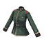 |
| 10100950 | Unknown |  |
| 10100951 | Unknown |  |
| 10100960 | Unknown |  |
| 10100961 | Unknown |  |
| 10100962 | Unknown |  |
| 10100970 | Unknown |  |
| 10100990 | 不明 |  |
| 10101010 | Unknown |  |
| 10101011 | Unknown |  |
| 10101012 | Unknown |  |
| 10101013 | Unknown |  |
| 10101014 | Unknown |  |
| 10101020 | Unknown |  |
| 10101021 | Unknown |  |
| 10101030 | Unknown |  |
| 10101040 | Unknown |  |
| 10101050 | Unknown |  |
| 10101060 | Unknown |  |
| 10101061 | Unknown |  |
| 10101062 | Unknown |  |
| 10101063 | Unknown |  |
| 10101070 | Unknown |  |
| 10101071 | Unknown |  |
| 10101072 | Unknown |  |
| 10101080 | Unknown |  |
| 10101081 | Unknown |  |
| 10101090 | Unknown |  |
| 10101091 | Unknown |  |
| 10101092 | Unknown |  |
| 10101093 | Unknown |  |
| 10101094 | Unknown |  |
| 10101095 | Unknown |  |
| 10101100 | Unknown |  |
| 10101101 | Unknown |  |
| 10101102 | Unknown |  |
| 10101110 | Unknown |  |
| 10101120 | Unknown |  |
| 10101130 | Unknown |  |
| 10101131 | Unknown |  |
| 10101132 | Unknown |  |
| 10101140 | Unknown |  |
| 10101141 | Unknown |  |
| 10101142 | Unknown |  |
| 10101150 | Unknown |  |
| 10101151 | Unknown |  |
| 10101152 | Unknown |  |
| 10101160 | Unknown |  |
| 10101170 | Unknown |  |
| 10101180 | Unknown |  |
| 10101190 | Unknown |  |
| 10101191 | Unknown |  |
| 10101200 | Unknown |  |
| 10101210 | Unknown |  |
| 10101220 | Unknown |  |
| 10101230 | Unknown |  |
| 10101240 | Unknown |  |
| 10101241 | Unknown |  |
| 10101250 | Unknown |  |
| 10101270 | Unknown |  |
| 10101290 | Unknown |  |
| 10101300 | Unknown |  |
| 10101310 | Unknown |  |
| 10101320 | Unknown |  |
| 10101330 | Unknown |  |
| 10101331 | Unknown |  |
| 10101332 | Unknown |  |
| 10101340 | Unknown |  |
| 10101341 | Unknown |  |
| 10101342 | Unknown |  |
| 10101350 | Unknown |  |
| 10101360 | Unknown |  |
| 10101370 | Unknown |  |
| 10101380 | Unknown |  |
| 10101390 | Unknown |  |
| 10101400 | Unknown |  |
| 10101410 | Unknown |  |
| 10101411 | Unknown |  |
| 10101420 | Unknown |  |
| 10101421 | Unknown |  |
| 10101430 | Unknown |  |
| 10101440 | Unknown |  |
| 10101441 | Unknown |  |
| 10101442 | Unknown |  |
| 10101450 | Unknown |  |
| 10101460 | Unknown |  |
| 10101461 | Unknown |  |
| 10101462 | Unknown |  |
| 10101470 | Unknown |  |
| 10101480 | Unknown |  |
| 10101481 | Unknown |  |
| 10101490 | Unknown |  |
| 10101500 | Unknown |  |
| 10101510 | Unknown |  |
| 10101520 | Unknown |  |
| 10101530 | Unknown |  |
| 10101540 | Unknown |  |
| 10101541 | Unknown |  |
| 10101550 | Unknown |  |
| 10101560 | Unknown |  |
| 10101580 | Unknown |  |
| 10101581 | Unknown |  |
| 10101590 | Unknown |  |
| 10101591 | Unknown |  |
| 10101620 | Unknown |  |
| 10101621 | Unknown |  |
| 10101630 | Unknown |  |
| 10101631 | Unknown |  |
| 10101640 | Unknown |  |
| 10101660 | Unknown |  |
| 10101670 | Unknown |  |
| 10101672 | Unknown |  |
| 10101681 | Unknown |  |
| 10101690 | Unknown |  |
| 10101700 | Unknown |  |
| 10101710 | Unknown |  |
| 10101720 | Unknown |  |
| 10101730 | Unknown |  |
| 10101740 | Unknown |  |
| 10101750 | Unknown |  |
| 10101760 | Unknown |  |
| 10101770 | Unknown |  |
| 10101780 | Unknown |  |
| 10101790 | Unknown |  |
| 10101800 | Unknown |  |
| 10101801 | Unknown |  |
| 10101810 | Unknown |  |
| 10101811 | Unknown |  |
| 10101820 | Unknown |  |
| 10101821 | Unknown |  |
| 10101830 | Unknown |  |
| 10101840 | Unknown |  |
| 10101841 | Unknown |  |
| 10101850 | Unknown |  |
| 10101851 | Unknown |  |
| 10101860 | Unknown |  |
| 10101870 | Unknown |  |
| 10101880 | Unknown |  |
| 10101890 | Unknown |  |
| 10101900 | Unknown |  |
| 10101910 | Unknown |  |
| 10101920 | Unknown |  |
| 10101930 | Unknown |  |
| 10101940 | Unknown |  |
| 10101950 | Unknown |  |
| 10101960 | Unknown |  |
| 10101970 | Unknown |  |
| 10101980 | Unknown |  |
| 10101990 | Unknown |  |
| 10102000 | Unknown |  |
| 10102010 | Unknown |  |
| 10102020 | Unknown |  |
| 10102030 | Unknown |  |
| 10102040 | Unknown |  |
| 10200000 | 光坂高校・女子スカート |  |
| 10200010 | バーベナ学園・女子スカート |  |
| 10200013 | Rバーベナ学園冬服スカート♀ |  |
| 10200030 | プリーツミニスカート(黒) |  |
| 10200040 | カーゴパンツ(カーキ)♀ |  |
| 10200041 | カーゴパンツ(黒)♀ |  |
| 10200042 | カーゴパンツ(紺)♀ |  |
| 10200050 | ティアードミニ(緑) |  |
| 10200051 | ティアードミニ(ピンク) |  |
| 10200052 | ティアードミニ(白) |  |
| 10200053 | ティアードミニ(黒無地)・未公開? |  |
| 10200054 | ティアードミニ(白無地)・未公開? |  |
| 10200060 | ラップスカート(カーキ) |  |
| 10200061 | ラップスカート(グレー) |  |
| 10200062 | Unknown |  |
| 10200070 | チェックスカート(赤) |  |
| 10200071 | 不明 |  |
| 10200072 | Unknown |  |
| 10200073 | Unknown |  |
| 10200074 | Unknown |  |
| 10200080 | 不思議ちゃんのスカート |  |
| 10200090 | ショートパンツ(白)♀ |  |
| 10200091 | ショートパンツ(オリーブ)♀ |  |
| 10200092 | ショートパンツ(黒)♀ |  |
| 10200093 | ショートパンツ(デニム)♀ |  |
| 10200094 | ショートパンツ(ベージュ)♀ |  |
| 10200100 | (男性用アイテム) |  |
| 10200101 | (男性用アイテム) |  |
| 10200102 | (男性用アイテム) |  |
| 10200103 | (男性用アイテム) |  |
| 10200104 | (男性用アイテム) |  |
| 10200105 | (男性用アイテム) |  |
| 10200106 | (男性用アイテム) |  |
| 10200110 | (男性用アイテム) |  |
| 10200111 | (男性用アイテム) |  |
| 10200112 | (男性用アイテム) |  |
| 10200130 | (男性用アイテム) |  |
| 10200131 | (男性用アイテム) |  |
| 10200132 | (男性用アイテム) |  |
| 10200140 | (男性用アイテム) |  |
| 10200150 | (男性用アイテム) |  |
| 10200151 | (男性用アイテム) |  |
| 10200152 | (男性用アイテム) |  |
| 10200160 | (男性用アイテム) |  |
| 10200170 | (男性用アイテム) |  |
| 10200180 | (男性用アイテム) |  |
| 10200190 | (男性用アイテム) |  |
| 10200200 | (男性用アイテム) |  |
| 10200210 | (男性用アイテム) |  |
| 10200250 | ロマンススカート(クリーム) |  |
| 10200260 | 教師のスカート(紫) |  |
| 10200262 | 教師のスカート(黒) |  |
| 10200270 | カブリパンツ(デニム)♀ |  |
| 10200280 | 風見学園付属校・スカート |  |
| 10200283 | Unknown |  |
| 10200290 | (男性用アイテム) |  |
| 10200300 | そよ風のミニスカート(黒) |  |
| 10200301 | そよ風のミニスカート(グレー) |  |
| 10200302 | そよ風のミニスカート(赤) |  |
| 10200303 | そよ風のミニスカート(茶) |  |
| 10200304 | そよ風のミニスカート(青) |  |
| 10200305 | そよ風のミニスカート(白) |  |
| 10200306 | そよ風のミニスカート(ピンク) |  |
| 10200307 | そよ風のミニスカート(水色) |  |
| 10200310 | ニットスカート(白) |  |
| 10200311 | ニットスカート(黒) |  |
| 10200312 | ニットスカート(ピンク) |  |
| 10200320 | ななかとお揃いのスカート♀ |  |
| 10200330 | ヴァイススカート♀ |  |
| 10200331 | シュヴァルツスカート♀ |  |
| 10200340 | ヘリンボーンスカート(ピンク) |  |
| 10200341 | ヘリンボーンスカート(水色) |  |
| 10200350 | ゴスパンクスカート(赤)♀ |  |
| 10200351 | ゴスパンクスカート(青)♀ |  |
| 10200360 | お嬢様のジャンスカ(黒)・未公開? |  |
| 10200361 | お嬢様のジャンスカ(ワイン)♀ |  |
| 10200362 | Unknown |  |
| 10200370 | 由夢とお揃いのジャージ♀下 |  |
| 10200380 | シフォンプリーツ(ホワイト)♀ |  |
| 10200381 | シフォンプリーツ(グレー)♀ |  |
| 10200382 | シフォンプリーツ(ベージュ)♀ |  |
| 10200383 | Unknown |  |
| 10200400 | (男性用アイテム) |  |
| 10200410 | (男性用アイテム) |  |
| 10200420 | ジャージ♂?(黒) |  |
| 10200421 | ジャージ♂?(赤) |  |
| 10200422 | ジャージ♂?(青) |  |
| 10200423 | ジャージ♂?(黄) |  |
| 10200424 | ジャージ♂?(白) |  |
| 10200430 | (男性用アイテム) |  |
| 10200431 | (男性用アイテム) |  |
| 10200432 | (男性用アイテム) |  |
| 10200433 | (男性用アイテム) |  |
| 10200434 | (男性用アイテム) |  |
| 10200440 | (男性用アイテム) |  |
| 10200450 | Unknown |  |
| 10200480 | Unknown |  |
| 10200481 | Unknown |  |
| 10200482 | Unknown |  |
| 10200490 | Unknown |  |
| 10200500 | Unknown |  |
| 10200510 | Unknown |  |
| 10200520 | Unknown |  |
| 10200530 | Unknown |  |
| 10200540 | Unknown |  |
| 10200550 | Unknown |  |
| 10200560 | Unknown |  |
| 10200570 | Unknown |  |
| 10200580 | Unknown |  |
| 10200590 | Unknown | 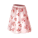 |
| 10200600 | Unknown |  |
| 10200610 | Unknown |  |
| 10200611 | Unknown |  |
| 10200612 | Unknown |  |
| 10200620 | Unknown |  |
| 10200630 | Unknown |  |
| 10200640 | Unknown |  |
| 10200641 | Unknown |  |
| 10200650 | Unknown |  |
| 10200670 | Unknown |  |
| 10200671 | Unknown |  |
| 10200680 | Unknown |  |
| 10200700 | Unknown |  |
| 10200710 | Unknown |  |
| 10200712 | Unknown |  |
| 10200721 | Unknown |  |
| 10200730 | Unknown |  |
| 10200740 | Unknown |  |
| 10200750 | Unknown |  |
| 10200760 | Unknown |  |
| 10200761 | Unknown |  |
| 10200770 | Unknown |  |
| 10200771 | Unknown |  |
| 10200780 | Unknown |  |
| 10200790 | Unknown |  |
| 10200800 | Unknown |  |
| 10200810 | Unknown |  |
| 10200820 | Unknown | 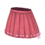 |
| 10200830 | Unknown |  |
| 10200840 | Unknown |  |
| 10200850 | Unknown |  |
| 10300000 | プリンセスグローブ(白) |  |
| 10300002 | プリンセスグローブ(水色) |  |
| 10300004 | プリンセスグローブ(黒) |  |
| 10300010 | しましまアームカバー(赤) |  |
| 10300011 | しましまアームカバー(青) |  |
| 10300012 | しましまアームカバー(緑) |  |
| 10300020 | 肉球手袋 |  |
| 10300030 | (男性用アイテム) |  |
| 10300040 | (男性用アイテム) |  |
| 10300050 | (男性用アイテム) |  |
| 10300060 | (男性用アイテム) |  |
| 10300070 | (男性用アイテム) |  |
| 10300080 | メリーメリーグローブ(赤白)♀ |  |
| 10300081 | メリーメリーグローブ(白白)♀ |  |
| 10300090 | ポンポンニットグローブ |  |
| 10300100 | レースの手袋♀(ピンク) |  |
| 10300101 | レースの手袋♀(黒) |  |
| 10300110 | Unknown |  |
| 10300111 | Unknown |  |
| 10300120 | Unknown |  |
| 10300121 | Unknown |  |
| 10300122 | Unknown |  |
| 10300123 | Unknown |  |
| 10300124 | Unknown |  |
| 10300125 | Unknown |  |
| 10300130 | Unknown |  |
| 10300140 | Unknown |  |
| 10300141 | Unknown |  |
| 10300150 | Unknown |  |
| 10300160 | Unknown |  |
| 10300161 | Unknown |  |
| 10300170 | Unknown |  |
| 10300190 | Unknown |  |
| 10400000 | 無地ソックス(白) |  |
| 10400001 | 無地ソックス(紺) |  |
| 10400002 | 無地ソックス(黒) |  |
| 10400003 | 無地ソックス(ピンク) |  |
| 10400004 | 無地ソックス(水色) |  |
| 10400010 | オーバーニー(灰)♀ |  |
| 10400011 | オーバーニー(黒)♀ |  |
| 10400012 | オーバーニー(白)♀ |  |
| 10400013 | オーバーニー(白黒)♀ |  |
| 10400014 | オーバーニー(赤黒)♀ |  |
| 10400015 | オーバーニー(橙黒)♀ |  |
| 10400016 | オーバーニー(水色)♀ |  |
| 10400017 | オーバーニー(黒)♀ |  |
| 10400018 | オーバーニー(水色&白)♀ |  |
| 10400019 | オーバーニー(ピンク&白)♀ |  |
| 10400020 | しましまソックス(水色) |  |
| 10400021 | しましまソックス(ピンク) |  |
| 10400022 | しましまソックス(赤) |  |
| 10400023 | しましまソックス(白) |  |
| 10400024 | しましまソックス(オレンジ) |  |
| 10400030 | メンズソックス |  |
| 10400031 | メンズソックス |  |
| 10400032 | メンズソックス |  |
| 10400033 | メンズソックス |  |
| 10400034 | メンズソックス |  |
| 10400040 | スニーカーソックス(白) |  |
| 10400041 | スニーカーソックス(白黒) |  |
| 10400042 | スニーカーソックス(グレー) |  |
| 10400043 | スニーカーソックス(黒) |  |
| 10400044 | スニーカーソックス(赤) |  |
| 10400045 | スニーカーソックス(青?) |  |
| 10400060 | ひざ上オーバーニー(白) |  |
| 10400061 | ひざ上オーバーニー(黒) |  |
| 10400062 | ひざ上オーバーニー(こげ茶) |  |
| 10400070 | 木綿の白足袋 |  |
| 10400071 | Unknown |  |
| 10400080 | リボンオーバーニー(ピンク) |  |
| 10400081 | リボンオーバーニー(黒) |  |
| 10400090 | 小恋とお揃いのオーバーニー(白) |  |
| 10400100 | 関羽とお揃い靴下♀ |  |
| 10400110 | Unknown |  |
| 10400111 | Unknown |  |
| 10400112 | Unknown |  |
| 10400120 | Unknown |  |
| 10400121 | Unknown |  |
| 10400122 | Unknown |  |
| 10400130 | Unknown |  |
| 10400131 | Unknown |  |
| 10400132 | Unknown |  |
| 10400140 | Unknown |  |
| 10400150 | Unknown |  |
| 10400160 | Unknown |  |
| 10400161 | Unknown |  |
| 10400170 | Unknown |  |
| 10400180 | Unknown |  |
| 10400190 | Unknown |  |
| 10400200 | Unknown |  |
| 10400210 | Unknown |  |
| 10400220 | Unknown |  |
| 10400221 | Unknown |  |
| 10400230 | Unknown |  |
| 10400240 | Unknown |  |
| 10400250 | Unknown |  |
| 10400260 | Unknown |  |
| 10400270 | Unknown |  |
| 10400280 | Unknown |  |
| 10400300 | Unknown |  |
| 10400310 | Unknown |  |
| 10400320 | Unknown |  |
| 10400330 | Unknown |  |
| 10400340 | Unknown |  |
| 10499990 | 無地ハイソックス(灰) |  |
| 10499991 | 不明(男性用?) |  |
| 10499992 | 不明(男性用?) | 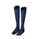 |
| 10499999 | 無地ハイソックス(黒)・未公開? |  |
| 10500000 | ワークシューズ(赤) |  |
| 10500010 | キャンバススニーカー(黒) |  |
| 10500011 | キャンバススニーカー(白) |  |
| 10500012 | キャンバススニーカー(緑) |  |
| 10500013 | Unknown |  |
| 10500014 | Unknown |  |
| 10500020 | チャイナヒール(青) |  |
| 10500021 | チャイナヒール(赤) |  |
| 10500022 | チャイナヒール(白) |  |
| 10500023 | チャイナヒール(桜) |  |
| 10500024 | Unknown |  |
| 10500030 | バーベナ学園・女子シューズ |  |
| 10500040 | ローファー(茶) |  |
| 10500041 | 亜沙とお揃いのローファー |  |
| 10500045 | Unknown |  |
| 10500046 | Unknown |  |
| 10500047 | Unknown |  |
| 10500048 | Unknown |  |
| 10500050 | 音姫とお揃いのブーツ |  |
| 10500060 | ミリタリーロングブーツ(迷彩) |  |
| 10500070 | (男性用アイテム) |  |
| 10500071 | (男性用アイテム) |  |
| 10500072 | (男性用アイテム) |  |
| 10500090 | アイコンのみ(黒ローファー)・未使用? |  |
| 10500091 | アイコンのみ(茶ローファー)・未使用? |  |
| 10500100 | アイコンのみ(下駄) |  |
| 10500101 | Unknown | 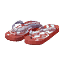 |
| 10500102 | Unknown |  |
| 10500110 | バスケットシューズ♂ |  |
| 10500111 | バスケットシューズ♂ |  |
| 10500112 | バスケットシューズ♂ |  |
| 10500120 | (男性用アイテム) |  |
| 10500130 | 革のハイヒール(黒) |  |
| 10500131 | 革のハイヒール(白) |  |
| 10500132 | 革のハイヒール(金) |  |
| 10500133 | 革のハイヒール(ピンク) |  |
| 10500134 | 革のハイヒール(赤) |  |
| 10500135 | 革のハイヒール(青) |  |
| 10500150 | ウェスタンブーツ(こげ茶)♀ |  |
| 10500151 | ウェスタンブーツ(黒)♀ |  |
| 10500152 | ウェスタンブーツ(茶)♀ |  |
| 10500160 | 小恋とお揃いの靴♀? |  |
| 10500180 | 四角い黄色いもの? 背高い |  |
| 10500190 | ムートンブーツ(ベージュ) |  |
| 10500191 | ムートンブーツ(白) |  |
| 10500192 | ムートンブーツ(茶) |  |
| 10500200 | メリーメリーブーツ(赤白)♀ |  |
| 10500201 | メリーメリーブーツ(白白)♀ |  |
| 10500210 | 船形下駄(赤) |  |
| 10500211 | 船形下駄(黒) |  |
| 10500212 | 船形下駄(黄) |  |
| 10500213 | 船形下駄(青) |  |
| 10500214 | Unknown |  |
| 10500215 | Unknown |  |
| 10500220 | 足ティッシュ |  |
| 10500230 | ヴァイスブーツ♀ |  |
| 10500231 | シュヴァルツブーツ♀ |  |
| 10500240 | ゴスロリワルツシューズ♀(黒) |  |
| 10500241 | Unknown |  |
| 10500242 | Unknown |  |
| 10500250 | レースのシューズ♀(白) |  |
| 10500260 | ショートブーツ(黒) |  |
| 10500261 | ショートブーツ(茶) |  |
| 10500262 | Unknown |  |
| 10500263 | Unknown |  |
| 10500270 | ニーハイブーツ♀(黒) |  |
| 10500271 | ニーハイブーツ♀(白) |  |
| 10500280 | ゴスパンクシューズ♀(黒) |  |
| 10500281 | ゴスパンクシューズ♀(白) |  |
| 10500290 | バレリーナシューズ♀(白) |  |
| 10500291 | バレリーナシューズ♀(黒) |  |
| 10500300 | 茶色のローファー風・未公開 |  |
| 10500310 | ななかとお揃いのブーツ♀ |  |
| 10500320 | 雪村杏とお揃いの靴♀ |  |
| 10500330 | 喫茶フローラシューズ♀ |  |
| 10500340 | 関羽とお揃いの靴♀ |  |
| 10500360 | 不明 |  |
| 10500361 | Unknown |  |
| 10500370 | Unknown |  |
| 10500371 | Unknown |  |
| 10500372 | Unknown |  |
| 10500380 | Unknown |  |
| 10500390 | Unknown |  |
| 10500391 | Unknown |  |
| 10500400 | Unknown |  |
| 10500401 | Unknown |  |
| 10500402 | Unknown |  |
| 10500410 | Unknown |  |
| 10500420 | Unknown |  |
| 10500421 | Unknown |  |
| 10500430 | Unknown |  |
| 10500431 | Unknown |  |
| 10500440 | Unknown |  |
| 10500450 | Unknown |  |
| 10500451 | Unknown | 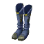 |
| 10500460 | Unknown |  |
| 10500470 | Unknown |  |
| 10500480 | Unknown |  |
| 10500481 | Unknown |  |
| 10500490 | Unknown |  |
| 10500510 | Unknown |  |
| 10500530 | Unknown |  |
| 10500540 | Unknown |  |
| 10500550 | Unknown |  |
| 10500560 | Unknown |  |
| 10500570 | Unknown |  |
| 10500580 | Unknown |  |
| 10500590 | Unknown |  |
| 10500600 | Unknown |  |
| 10500610 | Unknown |  |
| 10500611 | Unknown |  |
| 10500612 | Unknown |  |
| 10500620 | Unknown |  |
| 10500630 | Unknown |  |
| 10500631 | Unknown |  |
| 10500640 | Unknown |  |
| 10500650 | Unknown |  |
| 10500651 | Unknown |  |
| 10500652 | Unknown |  |
| 10500660 | Unknown |  |
| 10500670 | Unknown |  |
| 10500671 | Unknown |  |
| 10500680 | Unknown |  |
| 10500690 | Unknown |  |
| 10500700 | Unknown |  |
| 10500710 | Unknown |  |
| 10500720 | Unknown |  |
| 10500730 | Unknown |  |
| 10500740 | Unknown |  |
| 10500750 | Unknown |  |
| 10500760 | Unknown |  |
| 10600000 | プリティーブラ(ピンク) |  |
| 10600001 | プリティーブラ(白) |  |
| 10600002 | プリティーブラ(黄) |  |
| 10600010 | チェックの紐ブラ(水色) |  |
| 10600013 | Unknown |  |
| 10600014 | Unknown |  |
| 10600015 | Unknown |  |
| 10600016 | Unknown |  |
| 10600020 | 音姫とお揃いのブラ |  |
| 10600030 | Ｔシャツブラ(ベージュ) |  |
| 10600040 | 不明 |  |
| 10600043 | Unknown |  |
| 10600044 | Unknown |  |
| 10600050 | Unknown |  |
| 10600070 | Unknown |  |
| 10600080 | Unknown |  |
| 10600090 | Unknown |  |
| 10600100 | Unknown |  |
| 10600110 | Unknown |  |
| 10600120 | Unknown |  |
| 10600121 | Unknown |  |
| 10600122 | Unknown |  |
| 10700000 | プリティーショーツ(ピンク) |  |
| 10700001 | プリティーショーツ(白) |  |
| 10700002 | プリティーショーツ(黄) |  |
| 10700010 | チェックの紐パン(水色)♀ |  |
| 10700013 | Unknown |  |
| 10700014 | Unknown |  |
| 10700015 | Unknown |  |
| 10700016 | Unknown |  |
| 10700020 | 音姫とお揃いショーツ |  |
| 10700030 | (男性用アイテム) |  |
| 10700031 | (男性用アイテム) |  |
| 10700032 | (男性用アイテム) |  |
| 10700040 | 不明 |  |
| 10700041 | 不明 |  |
| 10700042 | 不明 |  |
| 10700050 | (男性用アイテム) |  |
| 10700051 | (男性用アイテム) |  |
| 10700052 | (男性用アイテム) |  |
| 10700060 | ダイヤ柄ストッキング(黒) |  |
| 10700061 | ダイヤ柄ストッキング(赤) |  |
| 10700062 | ダイヤ柄ストッキング(ベージュ) |  |
| 10700063 | ダイヤ柄ストッキング(紫) |  |
| 10700070 | ニットタイツ(グレー) |  |
| 10700071 | ニットタイツ(黒) |  |
| 10700072 | 風子とお揃いのタイツ♀ |  |
| 10700080 | 雪村杏とお揃いのオーバーニー♀ |  |
| 10700090 | 喫茶フローラソックス(白)♀ |  |
| 10700100 | 喫茶フローラソックス(黒)♀ |  |
| 10700110 | 縞パン(青) |  |
| 10700111 | 縞パン(緑) |  |
| 10700112 | Unknown |  |
| 10700130 | Unknown |  |
| 10700131 | Unknown |  |
| 10700140 | Unknown |  |
| 10700150 | Unknown |  |
| 10700160 | Unknown |  |
| 10700170 | Unknown |  |
| 10700180 | Unknown |  |
| 10700190 | Unknown |  |
| 10700200 | Unknown |  |
| 10700201 | Unknown |  |
| 10700202 | Unknown |  |
| 10700210 | Unknown |  |
| 10800000 | ふちなしメガネ |  |
| 10800010 | ノーマルフレーム(黒) |  |
| 10800011 | ノーマルフレーム(金) |  |
| 10800012 | ノーマルフレーム(銀) |  |
| 10800013 | Unknown |  |
| 10800014 | Unknown |  |
| 10800020 | モードフレーム(赤) |  |
| 10800021 | モードフレーム(緑) |  |
| 10800022 | モードフレーム(黄色) |  |
| 10800023 | モードフレーム(青) |  |
| 10800030 | スクエアフレーム(緑) |  |
| 10800031 | スクエアフレーム(水色) |  |
| 10800032 | スクエアフレーム(ピンク) |  |
| 10800040 | 教育ママのメガネ(銀) |  |
| 10800041 | 教育ママのメガネ(金) |  |
| 10800042 | 教育ママのメガネ(黒) |  |
| 10800050 | オールドサングラス(黒) |  |
| 10800060 | サイバーなゴーグル |  |
| 10800061 | Unknown |  |
| 10800062 | Unknown |  |
| 10800070 | ゴーストマスク |  |
| 10800080 | ふわふわピアス(白) |  |
| 10800081 | ふわふわピアス(黒) |  |
| 10800082 | ふわふわピアス(オフホワイト) |  |
| 10800090 | ガーゼの眼帯 |  |
| 10800091 | ローズアイパッチ |  |
| 10800092 | 海賊の眼帯 |  |
| 10800093 | Unknown |  |
| 10800094 | Unknown |  |
| 10800095 | Unknown |  |
| 10800100 | フープピアス(金) |  |
| 10800101 | フープピアス(銀) |  |
| 10800110 | 鼻眼鏡 |  |
| 10800120 | ぐるぐる眼鏡(黒) |  |
| 10800121 | ぐるぐる眼鏡(白) |  |
| 10800130 | 不明 |  |
| 10800131 | Unknown |  |
| 10800150 | Unknown |  |
| 10800151 | Unknown |  |
| 10800152 | Unknown |  |
| 10800153 | Unknown |  |
| 10800160 | Unknown |  |
| 10800161 | Unknown |  |
| 10800190 | Unknown |  |
| 10800191 | Unknown |  |
| 10800192 | Unknown |  |
| 10800193 | Unknown |  |
| 10800200 | Unknown |  |
| 10800201 | Unknown |  |
| 10800202 | Unknown |  |
| 10800203 | Unknown |  |
| 10800210 | Unknown |  |
| 10800211 | Unknown |  |
| 10800212 | Unknown |  |
| 10800213 | Unknown |  |
| 10899999 | 団長腕輪 |  |
| 10900000 | 朝倉音姫ウィッグ |  |
| 10900010 | リシアンサスウィッグ |  |
| 10900020 | 古河渚ウィッグ |  |
| 10900030 | お嬢様ロング(ブラウン) |  |
| 10900031 | お嬢様ロング(ブラック) |  |
| 10900032 | お嬢様ロング(ディープレッド) |  |
| 10900033 | お嬢様ロング(ライトブラウン) |  |
| 10900034 | お嬢様ロング(グレー) |  |
| 10900040 | クラシックボブ(ブラウン) |  |
| 10900041 | クラシックボブ(ブラック) |  |
| 10900042 | クラシックボブ(ディープレッド) |  |
| 10900043 | クラシックボブ(ライトブラウン) |  |
| 10900044 | クラシックボブ(グレー) |  |
| 10900050 | カチューシャボブ(ダークブルー) |  |
| 10900051 | カチューシャボブ(ダークレッド) |  |
| 10900052 | カチューシャボブ(ブラウン) |  |
| 10900053 | カチューシャボブ(グレー) |  |
| 10900054 | カチューシャボブ(パープル) |  |
| 10900060 | プチツイン(ダークブルー) |  |
| 10900061 | プチツイン(ダークレッド) |  |
| 10900062 | プチツイン(ブラウン) |  |
| 10900063 | プチツイン(グレー) |  |
| 10900064 | プチツイン(パープル) |  |
| 10900070 | ガーリーポニーテール(ブラウン) |  |
| 10900071 | ガーリーポニーテール(ブルー) |  |
| 10900072 | ガーリーポニーテール(グリーン) |  |
| 10900073 | ガーリーポニーテール(パープル) |  |
| 10900074 | ガーリーポニーテールオレンジ |  |
| 10900080 | スプリングレイヤー(ブラウン) |  |
| 10900081 | スプリングレイヤー(ブルー) |  |
| 10900082 | スプリングレイヤー(グリーン) |  |
| 10900083 | スプリングレイヤー(パープル) |  |
| 10900084 | スプリングレイヤー(オレンジ) |  |
| 10900100 | 不明 |  |
| 10900101 | 不明 |  |
| 10900102 | 不明 |  |
| 10900103 | 不明 |  |
| 10900104 | 不明 |  |
| 10900110 | 消滅? ショートボブ?(焦茶) |  |
| 10900111 | 消滅? ショートボブ?(水色) |  |
| 10900112 | 消滅? ショートボブ?(茶) |  |
| 10900113 | 消滅? ショートボブ?(紫) |  |
| 10900114 | 消滅? ショートボブ?(黒) |  |
| 10900120 | 不明 |  |
| 10900121 | 不明 |  |
| 10900122 | 不明 |  |
| 10900123 | 不明 |  |
| 10900124 | 不明 |  |
| 10900140 | おかっぱ(黒) NPC用 |  |
| 10900141 | おかっぱ(水色) 未公開? |  |
| 10900142 | おかっぱ(焦茶) 未公開? |  |
| 10900143 | おかっぱ(茶) 未公開? |  |
| 10900144 | おかっぱ(金) 未公開? |  |
| 10900150 | ショート(紫) NPC用 |  |
| 10900151 | Unknown |  |
| 10900152 | Unknown |  |
| 10900153 | Unknown |  |
| 10900154 | Unknown |  |
| 10900160 | ポニーテール(薄茶) NPC用 |  |
| 10900161 | ポニーテール(灰) 未公開? |  |
| 10900162 | ポニーテール(白) 未公開? |  |
| 10900163 | ポニーテール(金) 未公開? |  |
| 10900164 | ポニーテール(緑) 未公開? |  |
| 10900170 | セクシーヘア(濃紫) NPC用 |  |
| 10900171 | セクシーヘア(濃茶) 未公開? |  |
| 10900172 | セクシーヘア(薄茶) 未公開? |  |
| 10900173 | セクシーヘア(灰) 未公開? |  |
| 10900174 | セクシーヘア(薄紫) 未公開? |  |
| 10900180 | エレガントボブ(ブラウン) |  |
| 10900181 | エレガントボブ(水色) 未公開? |  |
| 10900182 | エレガントボブ(緑) 未公開? |  |
| 10900183 | エレガントボブ(パープル) |  |
| 10900184 | エレガントボブ(薄茶) 未公開? |  |
| 10900200 | ネリネウィッグ♀ |  |
| 10900201 | Unknown |  |
| 10900210 | 芙蓉楓ウィッグ♀ |  |
| 10900211 | Unknown |  |
| 10900220 | 朝倉由夢ウィッグ♀ |  |
| 10900221 | Unknown |  |
| 10900230 | 白河ななかウィッグ♀ |  |
| 10900231 | Unknown |  |
| 10900240 | 雪村杏ウィッグ♀ 未公開? |  |
| 10900241 | Unknown |  |
| 10900250 | 月島小恋ウィッグ♀ 未公開? |  |
| 10900251 | Unknown |  |
| 10900260 | 藤林杏ウィッグ♀ |  |
| 10900270 | 坂上智代ウィッグ♀ |  |
| 10900280 | 一ノ瀬ことみウィッグ♀ |  |
| 10900290 | 伊吹風子ウィッグ♀ |  |
| 10900300 | プリムラウィッグ♀ |  |
| 10900301 | Unknown |  |
| 10900310 | 時雨亜沙ウィッグ♀ |  |
| 10910010 | 名称不明(黒) |  |
| 10910020 | 名称不明(エメラルドグリーン) |  |
| 10920010 | 不明(男性用?) |  |
| 10920011 | 不明(男性用?) |  |
| 10920012 | 不明(男性用?) |  |
| 10920013 | 不明(男性用?) |  |
| 10920014 | 不明(男性用?) |  |
| 10920020 | 不明(男性用?) |  |
| 10920021 | 不明(男性用?) |  |
| 10920022 | 不明(男性用?) |  |
| 10920023 | 不明(男性用?) |  |
| 10920024 | 不明(男性用?) |  |
| 10920030 | 不明(男性用?) |  |
| 10920031 | 不明(男性用?) |  |
| 10920032 | 不明(男性用?) |  |
| 10920033 | 不明(男性用?) |  |
| 10920034 | 不明(男性用?) |  |
| 10920040 | 不明(男性用?) |  |
| 10920041 | 不明(男性用?) |  |
| 10920042 | 不明(男性用?) |  |
| 10920043 | 不明(男性用?) |  |
| 10920044 | 不明(男性用?) |  |
| 10930010 | ショート系(水色) |  |
| 10930011 | ショート系(茶) |  |
| 10930012 | ショート系(ピンク) |  |
| 10930013 | ショート系(金) |  |
| 10930014 | ショート系(黒) |  |
| 10930020 | ロングストレート(ブルー) |  |
| 10930021 | ロングストレート(ブラウン) |  |
| 10930022 | ロングストレート(ピンク) |  |
| 10930023 | ロングストレート(ゴールド) |  |
| 10930024 | ロングストレート(ブラック) |  |
| 10930030 | 小悪魔ツイン(ライトブルー) |  |
| 10930031 | 小悪魔ツイン(ブラウン) |  |
| 10930032 | 小悪魔ツイン(ピンク) |  |
| 10930033 | 小悪魔ツイン(ゴールド) |  |
| 10930034 | 小悪魔ツイン(ブラック) |  |
| 10930040 | ミディアムボブ(ライトブルー) |  |
| 10930041 | ミディアムボブ(ブラウン) |  |
| 10930042 | ミディアムボブ(ピンク) |  |
| 10930043 | ミディアムボブ(ゴールド) |  |
| 10930044 | ミディアムボブ(ブラック) |  |
| 10930050 | ハッピーアフロ(ブラック) |  |
| 10930051 | ハッピーアフロ(グリーン) |  |
| 10930052 | ハッピーアフロ(ピンク) |  |
| 10930053 | ハッピーアフロ(イエロー) |  |
| 10930054 | Unknown |  |
| 10930055 | Unknown |  |
| 10930056 | Unknown |  |
| 10930060 | Unknown |  |
| 10930070 | Unknown |  |
| 10930080 | Unknown |  |
| 10930090 | Unknown |  |
| 10930091 | Unknown |  |
| 10930100 | Unknown |  |
| 10930120 | Unknown |  |
| 10930130 | Unknown |  |
| 10930140 | Unknown |  |
| 10930150 | Unknown |  |
| 10930160 | Unknown |  |
| 10930170 | Unknown |  |
| 10930180 | Unknown |  |
| 10930181 | Unknown |  |
| 10930190 | Unknown |  |
| 10930191 | Unknown |  |
| 10930200 | Unknown |  |
| 10930201 | Unknown |  |
| 10930210 | Unknown |  |
| 10930220 | Unknown |  |
| 10930221 | Unknown |  |
| 10930230 | Unknown |  |
| 10930240 | Unknown |  |
| 10930250 | Unknown |  |
| 10930260 | Unknown |  |
| 10930270 | Unknown |  |
| 10930280 | Unknown |  |
| 10930290 | Unknown |  |
| 10930291 | Unknown |  |
| 10930300 | Unknown |  |
| 10930301 | Unknown |  |
| 10930310 | Unknown |  |
| 10930311 | Unknown |  |
| 10930320 | Unknown |  |
| 10930321 | Unknown |  |
| 10930330 | Unknown |  |
| 10930340 | Unknown |  |
| 10930350 | Unknown |  |
| 10930360 | Unknown |  |
| 10930370 | Unknown |  |
| 11000000 | Unknown |  |
| 11000001 | Unknown |  |
| 11000002 | Unknown |  |
| 11000003 | Unknown |  |
| 11000010 | Unknown |  |
| 11000011 | Unknown |  |
| 11000012 | Unknown |  |
| 11000013 | Unknown |  |
| 11000014 | Unknown |  |
| 11000015 | Unknown |  |
| 11000020 | Unknown |  |
| 11000030 | Unknown |  |
| 11000040 | Unknown |  |
| 11000041 | Unknown |  |
| 11000042 | Unknown | 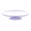 |
| 11000043 | Unknown |  |
| 11000050 | Unknown |  |
| 11000051 | Unknown |  |
| 11000052 | Unknown |  |
| 11000053 | Unknown |  |
| 11000060 | Unknown |  |
| 11000070 | Unknown |  |
| 11000080 | Unknown |  |
| 11000090 | Unknown |  |
| 11000100 | Unknown |  |
| 11000101 | Unknown |  |
| 11000102 | Unknown |  |
| 11000103 | Unknown |  |
| 11000110 | Unknown |  |
| 11000120 | Unknown |  |
| 11000130 | Unknown |  |
| 11000131 | Unknown |  |
| 11000132 | Unknown |  |
| 11000133 | Unknown |  |
| 11000134 | Unknown |  |
| 11000135 | Unknown |  |
| 11000136 | Unknown |  |
| 11000137 | Unknown |  |
| 11000138 | Unknown |  |
| 11000139 | Unknown |  |
| 11000140 | Unknown |  |
| 11000150 | Unknown |  |
| 11000160 | Unknown |  |
| 11000170 | Unknown |  |
| 11000171 | Unknown | 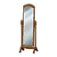 |
| 11000172 | Unknown |  |
| 11000173 | Unknown |  |
| 11000174 | Unknown |  |
| 11000175 | Unknown |  |
| 11000180 | Unknown |  |
| 11000190 | Unknown |  |
| 11000200 | Unknown |  |
| 11000210 | Unknown |  |
| 11000220 | Unknown |  |
| 11000230 | Unknown |  |
| 11000240 | Unknown |  |
| 11000250 | Unknown |  |
| 11000251 | Unknown |  |
| 11000252 | Unknown |  |
| 11000253 | Unknown |  |
| 11000260 | Unknown |  |
| 11000270 | Unknown |  |
| 11000280 | Unknown | 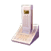 |
| 11000281 | Unknown |  |
| 11000282 | Unknown |  |
| 11000290 | Unknown |  |
| 11000300 | Unknown |  |
| 11000310 | Unknown |  |
| 11000320 | Unknown |  |
| 11000321 | Unknown |  |
| 11000322 | Unknown |  |
| 11000330 | Unknown |  |
| 11000340 | Unknown |  |
| 11000350 | Unknown |  |
| 11000550 | Unknown |  |
| 11000551 | Unknown |  |
| 11000552 | Unknown |  |
| 11000560 | Unknown |  |
| 11000561 | Unknown |  |
| 11000562 | Unknown |  |
| 11000570 | Unknown |  |
| 11000571 | Unknown |  |
| 11000572 | Unknown |  |
| 11000573 | Unknown |  |
| 11000574 | Unknown |  |
| 11000580 | Unknown |  |
| 11000581 | Unknown |  |
| 11000582 | Unknown |  |
| 11000583 | Unknown |  |
| 11000584 | Unknown |  |
| 11000590 | Unknown |  |
| 11000591 | Unknown |  |
| 11000600 | Unknown |  |
| 11000601 | Unknown | 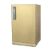 |
| 11000602 | Unknown |  |
| 11000603 | Unknown |  |
| 11000604 | Unknown |  |
| 11000605 | Unknown |  |
| 11000606 | Unknown |  |
| 11000607 | Unknown |  |
| 11000610 | Unknown |  |
| 11000611 | Unknown |  |
| 11000612 | Unknown |  |
| 11000613 | Unknown |  |
| 11000614 | Unknown |  |
| 11000615 | Unknown |  |
| 11000616 | Unknown |  |
| 11000617 | Unknown |  |
| 11000618 | Unknown |  |
| 11000620 | Unknown |  |
| 11000621 | Unknown |  |
| 11000622 | Unknown |  |
| 11000623 | Unknown |  |
| 11000624 | Unknown |  |
| 11000625 | Unknown |  |
| 11000630 | Unknown |  |
| 11000631 | Unknown |  |
| 11000632 | Unknown |  |
| 11000640 | Unknown |  |
| 11000650 | Unknown |  |
| 11000660 | Unknown |  |
| 11000700 | Unknown |  |
| 11000710 | Unknown |  |
| 11000720 | Unknown |  |
| 11000730 | Unknown |  |
| 11000740 | Unknown |  |
| 11000750 | Unknown |  |
| 11000760 | Unknown |  |
| 11000770 | Unknown |  |
| 11000780 | Unknown |  |
| 11000790 | Unknown |  |
| 11000800 | Unknown |  |
| 11000810 | Unknown |  |
| 11000820 | Unknown |  |
| 11000830 | Unknown |  |
| 11000840 | Unknown |  |
| 11000850 | Unknown |  |
| 11000860 | Unknown |  |
| 11000870 | Unknown |  |
| 11000880 | Unknown |  |
| 11000890 | Unknown |  |
| 11000900 | Unknown |  |
| 11000910 | Unknown |  |
| 11000920 | Unknown |  |
| 11000930 | Unknown |  |
| 11000940 | Unknown |  |
| 11000950 | Unknown |  |
| 11000960 | Unknown |  |
| 11000970 | Unknown |  |
| 11000971 | Unknown |  |
| 11000972 | Unknown |  |
| 11000973 | Unknown |  |
| 11000974 | Unknown |  |
| 11000975 | Unknown |  |
| 11000976 | Unknown |  |
| 11000977 | Unknown |  |
| 11000978 | Unknown |  |
| 11000980 | Unknown |  |
| 11000981 | Unknown |  |
| 11000982 | Unknown |  |
| 11000983 | Unknown |  |
| 11000990 | Unknown |  |
| 11000991 | Unknown | 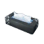 |
| 11000992 | Unknown |  |
| 11000993 | Unknown |  |
| 11000994 | Unknown |  |
| 11000995 | Unknown |  |
| 11001000 | Unknown |  |
| 11001010 | Unknown |  |
| 11001020 | Unknown |  |
| 11001030 | Unknown |  |
| 11001040 | Unknown |  |
| 11001050 | Unknown |  |
| 11001060 | Unknown |  |
| 11001070 | Unknown |  |
| 11001080 | Unknown |  |
| 11001090 | Unknown |  |
| 11001100 | Unknown |  |
| 11001110 | Unknown |  |
| 11001120 | Unknown |  |
| 11001121 | Unknown |  |
| 11001122 | Unknown |  |
| 11001123 | Unknown |  |
| 11001124 | Unknown |  |
| 11001125 | Unknown |  |
| 11001126 | Unknown |  |
| 11001127 | Unknown |  |
| 11001128 | Unknown |  |
| 11001130 | Unknown |  |
| 11001131 | Unknown |  |
| 11001132 | Unknown |  |
| 11001133 | Unknown |  |
| 11001140 | Unknown |  |
| 11001150 | Unknown |  |
| 11001160 | Unknown |  |
| 11001161 | Unknown |  |
| 11001162 | Unknown |  |
| 11001164 | Unknown |  |
| 11001165 | Unknown |  |
| 11001166 | Unknown |  |
| 11001167 | Unknown |  |
| 11001168 | Unknown |  |
| 11001170 | Unknown |  |
| 11001171 | Unknown |  |
| 11001172 | Unknown |  |
| 11001180 | Unknown |  |
| 11001190 | Unknown |  |
| 11001200 | Unknown |  |
| 11001210 | Unknown |  |
| 11001211 | Unknown |  |
| 11001220 | Unknown |  |
| 11001230 | Unknown |  |
| 11001240 | Unknown |  |
| 11001250 | Unknown |  |
| 11001260 | Unknown |  |
| 11001270 | Unknown |  |
| 11001280 | Unknown |  |
| 11001290 | Unknown |  |
| 11001291 | Unknown |  |
| 11001292 | Unknown |  |
| 11001293 | Unknown |  |
| 11001294 | Unknown |  |
| 11001300 | Unknown |  |
| 11001301 | Unknown |  |
| 11001302 | Unknown |  |
| 11001303 | Unknown |  |
| 11001310 | Unknown |  |
| 11001320 | Unknown |  |
| 11001330 | Unknown |  |
| 11001331 | Unknown |  |
| 11001332 | Unknown |  |
| 11001334 | Unknown |  |
| 11001335 | Unknown |  |
| 11001336 | Unknown |  |
| 11001337 | Unknown |  |
| 11001338 | Unknown |  |
| 11001339 | Unknown |  |
| 11001340 | Unknown |  |
| 11001341 | Unknown |  |
| 11001342 | Unknown |  |
| 11001343 | Unknown |  |
| 11001344 | Unknown |  |
| 11001346 | Unknown |  |
| 11001347 | Unknown |  |
| 11001348 | Unknown |  |
| 11001349 | Unknown |  |
| 11001350 | Unknown |  |
| 11001351 | Unknown |  |
| 11001352 | Unknown |  |
| 11001353 | Unknown |  |
| 11001354 | Unknown | 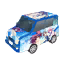 |
| 11001360 | Unknown |  |
| 11001371 | Unknown |  |
| 11001372 | Unknown |  |
| 11001373 | Unknown |  |
| 11001374 | Unknown |  |
| 11001375 | Unknown |  |
| 11001376 | Unknown |  |
| 11001378 | Unknown |  |
| 11001379 | Unknown |  |
| 11001380 | Unknown |  |
| 11001381 | Unknown |  |
| 11001382 | Unknown |  |
| 11001383 | Unknown |  |
| 11001384 | Unknown |  |
| 11001385 | Unknown |  |
| 11001387 | Unknown |  |
| 11001388 | Unknown |  |
| 11001390 | Unknown |  |
| 11001400 | Unknown |  |
| 11001410 | Unknown |  |
| 11001411 | Unknown |  |
| 11001412 | Unknown | 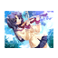 |
| 11001413 | Unknown |  |
| 11001420 | Unknown |  |
| 11001421 | Unknown |  |
| 11001422 | Unknown |  |
| 11001423 | Unknown |  |
| 11001424 | Unknown |  |
| 11001425 | Unknown | 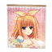 |
| 11001426 | Unknown |  |
| 11001427 | Unknown |  |
| 11001430 | Unknown |  |
| 11001440 | Unknown |  |
| 11001441 | Unknown |  |
| 11001442 | Unknown |  |
| 11001443 | Unknown |  |
| 11001450 | Unknown |  |
| 11001451 | Unknown |  |
| 11001452 | Unknown |  |
| 11001453 | Unknown |  |
| 11001454 | Unknown |  |
| 11001455 | Unknown |  |
| 11001460 | Unknown |  |
| 11001480 | Unknown |  |
| 11001490 | Unknown |  |
| 11001500 | Unknown |  |
| 11001510 | Unknown |  |
| 11001520 | Unknown |  |
| 11001530 | Unknown |  |
| 11001540 | Unknown |  |
| 11400000 | 天使の羽(白) |  |
| 11400001 | 天使の羽(水色) |  |
| 11400002 | 天使の羽(黒) |  |
| 11400003 | Unknown |  |
| 11400004 | Unknown |  |
| 11400005 | Unknown |  |
| 11400010 | 悪魔の羽(黒) |  |
| 11400011 | 悪魔の羽(紫) |  |
| 11400012 | 悪魔の羽(赤紫) |  |
| 11400013 | Unknown |  |
| 11400020 | スクールリュック |  |
| 11400021 | スクールリュック |  |
| 11400030 | リュックサック |  |
| 11400050 | 背負いティッシュ |  |
| 11400060 | たれうさリュック(モカ) |  |
| 11400061 | たれうさリュック(黒) |  |
| 11400062 | たれうさリュック(白) |  |
| 11400070 | くらにゃど「ネコ」しっぽ |  |
| 11400074 | Unknown |  |
| 11400080 | くらにゃど「くま」しっぽ |  |
| 11400090 | くらにゃど「きつね」しっぽ |  |
| 11400100 | くらにゃど「うさぎ」しっぽ |  |
| 11400110 | くらにゃど「いぬ」しっぽ |  |
| 11400120 | Unknown |  |
| 11400130 | Unknown |  |
| 11400140 | Unknown |  |
| 11400150 | Unknown |  |
| 11400160 | Unknown |  |
| 11401000 | Unknown |  |
| 11401001 | Unknown |  |
| 11401002 | Unknown |  |
| 11401003 | Unknown |  |
| 11401004 | Unknown |  |
| 11401005 | Unknown |  |
| 11401006 | Unknown |  |
| 11401007 | Unknown |  |
| 11401008 | Unknown |  |
| 11401009 | Unknown |  |
| 11401010 | Unknown |  |
| 11401020 | Unknown |  |
| 11401021 | Unknown |  |
| 11401022 | Unknown |  |
| 11401023 | Unknown |  |
| 11401024 | Unknown |  |
| 11401025 | Unknown |  |
| 11401026 | Unknown |  |
| 11401027 | Unknown |  |
| 11401028 | Unknown |  |
| 11401029 | Unknown |  |
| 11401030 | Unknown |  |
| 11401040 | Unknown |  |
| 11401041 | Unknown |  |
| 11401042 | Unknown |  |
| 11401043 | Unknown |  |
| 11401044 | Unknown |  |
| 11401045 | Unknown |  |
| 11401046 | Unknown |  |
| 11401047 | Unknown |  |
| 11401048 | Unknown |  |
| 11401049 | Unknown |  |
| 11401050 | Unknown |  |
| 11401060 | Unknown |  |
| 11401061 | Unknown |  |
| 11401062 | Unknown |  |
| 11401063 | Unknown |  |
| 11401064 | Unknown |  |
| 11401065 | Unknown |  |
| 11401066 | Unknown |  |
| 11401067 | Unknown |  |
| 11401068 | Unknown |  |
| 11401069 | Unknown |  |
| 11401070 | Unknown |  |
| 11401080 | Unknown |  |
| 11401081 | Unknown |  |
| 11401082 | Unknown |  |
| 11401083 | Unknown |  |
| 11401084 | Unknown |  |
| 11401085 | Unknown |  |
| 11401086 | Unknown |  |
| 11401087 | Unknown |  |
| 11401088 | Unknown |  |
| 11401089 | Unknown |  |
| 11401090 | Unknown |  |
| 11401100 | Unknown |  |
| 11401101 | Unknown |  |
| 11401102 | Unknown |  |
| 11401103 | Unknown |  |
| 11401104 | Unknown |  |
| 11401105 | Unknown |  |
| 11401106 | Unknown |  |
| 11401107 | Unknown |  |
| 11401108 | Unknown |  |
| 11401109 | Unknown |  |
| 11401110 | Unknown |  |
| 11401120 | Unknown |  |
| 11401121 | Unknown |  |
| 11401122 | Unknown |  |
| 11401123 | Unknown |  |
| 11401124 | Unknown |  |
| 11401125 | Unknown |  |
| 11401126 | Unknown |  |
| 11401127 | Unknown |  |
| 11401128 | Unknown |  |
| 11401129 | Unknown |  |
| 11401130 | Unknown |  |
| 11401140 | Unknown |  |
| 11401141 | Unknown |  |
| 11401142 | Unknown |  |
| 11401143 | Unknown |  |
| 11401144 | Unknown |  |
| 11401145 | Unknown |  |
| 11401146 | Unknown |  |
| 11401147 | Unknown |  |
| 11401148 | Unknown |  |
| 11401149 | Unknown |  |
| 11401150 | Unknown |  |
| 11401160 | Unknown |  |
| 11401161 | Unknown |  |
| 11401162 | Unknown |  |
| 11401163 | Unknown |  |
| 11401164 | Unknown |  |
| 11401165 | Unknown |  |
| 11401166 | Unknown |  |
| 11401167 | Unknown |  |
| 11401168 | Unknown |  |
| 11401169 | Unknown |  |
| 11401170 | Unknown |  |
| 11401180 | Unknown |  |
| 11401181 | Unknown |  |
| 11401182 | Unknown |  |
| 11401183 | Unknown |  |
| 11401184 | Unknown |  |
| 11401185 | Unknown |  |
| 11401186 | Unknown |  |
| 11401187 | Unknown |  |
| 11401188 | Unknown |  |
| 11401189 | Unknown |  |
| 11401190 | Unknown |  |
| 11401200 | Unknown |  |
| 11401201 | Unknown |  |
| 11401202 | Unknown |  |
| 11401203 | Unknown |  |
| 11401204 | Unknown |  |
| 11401205 | Unknown |  |
| 11401206 | Unknown |  |
| 11401207 | Unknown |  |
| 11401208 | Unknown |  |
| 11401209 | Unknown |  |
| 11401210 | Unknown |  |
| 11401220 | Unknown |  |
| 11401221 | Unknown |  |
| 11401222 | Unknown |  |
| 11401223 | Unknown |  |
| 11401224 | Unknown |  |
| 11401225 | Unknown |  |
| 11401226 | Unknown |  |
| 11401227 | Unknown |  |
| 11401228 | Unknown |  |
| 11401229 | Unknown |  |
| 11401230 | Unknown |  |
| 11401240 | Unknown |  |
| 11401241 | Unknown |  |
| 11401242 | Unknown |  |
| 11401243 | Unknown |  |
| 11401244 | Unknown |  |
| 11401245 | Unknown |  |
| 11401246 | Unknown |  |
| 11401247 | Unknown |  |
| 11401248 | Unknown |  |
| 11401249 | Unknown |  |
| 11401250 | Unknown |  |
| 11401260 | Unknown |  |
| 11401261 | Unknown |  |
| 11401262 | Unknown |  |
| 11401263 | Unknown |  |
| 11401264 | Unknown |  |
| 11401265 | Unknown |  |
| 11401266 | Unknown |  |
| 11401267 | Unknown |  |
| 11401268 | Unknown |  |
| 11401269 | Unknown |  |
| 11401270 | Unknown |  |
| 11401280 | Unknown |  |
| 11401281 | Unknown |  |
| 11401282 | Unknown |  |
| 11401283 | Unknown |  |
| 11401284 | Unknown |  |
| 11401285 | Unknown |  |
| 11401286 | Unknown |  |
| 11401287 | Unknown |  |
| 11401288 | Unknown |  |
| 11401289 | Unknown |  |
| 11401290 | Unknown |  |
| 11401300 | Unknown |  |
| 11401320 | Unknown |  |
| 11401340 | Unknown |  |
| 11401360 | Unknown |  |
| 11401380 | Unknown |  |
| 11401400 | Unknown |  |
| 11401420 | Unknown |  |
| 11401440 | Unknown |  |
| 11401460 | Unknown |  |
| 11401480 | Unknown |  |
| 11401500 | Unknown |  |
| 11401520 | Unknown |  |
| 11401540 | Unknown |  |
| 11401560 | Unknown |  |
| 11401580 | Unknown |  |
| 11401600 | Unknown |  |
| 11401620 | Unknown |  |
| 11401640 | Unknown |  |
| 11401660 | Unknown |  |
| 11500000 | 団長腕章 |  |
| 11500010 | レザーブレスレッド(白) |  |
| 11500011 | レザーブレスレッド(黒) |  |
| 11500012 | レザーブレスレッド(茶) |  |
| 11500040 | 風見学園・生徒会腕章 |  |
| 11500050 | リシアンサスとお揃いのリボン |  |
| 11500060 | 腕ティッシュ |  |
| 11500070 | ファーブレス(白) |  |
| 11500071 | Unknown |  |
| 11500080 | チェーンブレス(黒)♀ |  |
| 11500081 | チェーンブレス(白)♀ |  |
| 11500090 | 喫茶フローラリストリボン♀ |  |
| 11500100 | チェーンブレス(黒)♂ |  |
| 11500101 | チェーンブレス(白)♂ |  |
| 11500110 | Unknown |  |
| 11500130 | Unknown |  |
| 11500140 | Unknown |  |
| 11500150 | Unknown |  |
| 11600000 | ネコの首輪♀ | 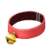 |
| 11600010 | 光坂高校・指定ネクタイ |  |
| 11600011 | 不明 |  |
| 11600020 | バーベナ学園・指定ネクタ |  |
| 11600030 | ティッシュ黒 ??? |  |
| 11600050 | ポンポンニットマフラー(緑)♀ |  |
| 11600051 | ポンポンニットマフラー(赤)♀ |  |
| 11600052 | ポンポンニットマフラー(白)♀ |  |
| 11600054 | ポンポンニットマフラー(赤)♂? |  |
| 11600060 | 王冠のネックレス(金) |  |
| 11600061 | 王冠のネックレス(金) |  |
| 11600070 | クロスチョーカー(金) |  |
| 11600071 | クロスチョーカー(銀) |  |
| 11600080 | ジップパンクタイ(赤黒) | 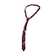 |
| 11600081 | ジップパンクタイ(白黒) |  |
| 11600090 | リボンネックレス(黒) |  |
| 11600091 | リボンネックレス(ワイン) |  |
| 11600100 | 大きい蝶リボン(黒) |  |
| 11600101 | 大きい蝶リボン(赤) |  |
| 11600102 | 大きい蝶リボン(茶?) |  |
| 11600110 | 音姫にもらったマフラー♂ |  |
| 11600130 | 音姫にもらったマフラー♀ |  |
| 11600150 | ネックレス(名称不明) | 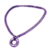 |
| 11600170 | Unknown |  |
| 11600180 | Unknown |  |
| 11600190 | Unknown |  |
| 11600191 | Unknown |  |
| 11600192 | Unknown |  |
| 11600200 | Unknown |  |
| 11600201 | Unknown |  |
| 11600210 | Unknown |  |
| 11600211 | Unknown |  |
| 11600220 | Unknown |  |
| 11600221 | Unknown |  |
| 11600230 | Unknown |  |
| 11600240 | Unknown |  |
| 11600250 | Unknown |  |
| 11600260 | Unknown |  |
| 11700020 | プチリボン(黄) |  |
| 11700021 | プチリボン(薄紫) |  |
| 11700022 | プチリボン(赤) |  |
| 11700023 | プチリボン(黒) |  |
| 11700024 | プチリボン(青) |  |
| 11700030 | リボンカチューシャ(赤) |  |
| 11700031 | リボンカチューシャ(ピンク) |  |
| 11700032 | リボンカチューシャ(黄) |  |
| 11700033 | リボンカチューシャ(水) |  |
| 11700034 | リボンカチューシャ(黒) |  |
| 11700040 | ケモ耳(茶) |  |
| 11700050 | うさみみ(白) |  |
| 11700051 | うさみみ(黒) |  |
| 11700052 | Unknown |  |
| 11700053 | Unknown |  |
| 11700060 | ねこみみ(白) |  |
| 11700070 | うさみみ(ピンク) |  |
| 11700080 | メモリアルクラウン(赤)♂ |  |
| 11700081 | メモリアルクラウン(青)♂ |  |
| 11700090 | メモリアルクラウン(赤)♀ |  |
| 11700091 | メモリアルクラウン(青)♀ |  |
| 11700100 | 由夢とお揃いのシニヨンカバー♀? |  |
| 11700110 | 頭ティッシュ |  |
| 11700120 | ホワイトブリム |  |
| 11700130 | トナカイカチューシャ |  |
| 11700131 | Unknown |  |
| 11700140 | 初春の大きなリボン(黄) | 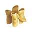 |
| 11700141 | 初春の大きなリボン(ピンク) |  |
| 11700150 | くらにゃど「ネコ」みみ |  |
| 11700160 | くらにゃど「くま」みみ |  |
| 11700170 | くらにゃど「きつね」みみ |  |
| 11700180 | くらにゃど「うさぎ」みみ |  |
| 11700190 | くらにゃど「いぬ」みみ |  |
| 11700200 | もこもこ耳当て |  |
| 11700201 | Unknown |  |
| 11700210 | リボンシルクハット(ピンク) |  |
| 11700211 | リボンシルクハット(黒) |  |
| 11700220 | オデット姫のティアラ(金) |  |
| 11700221 | オデット姫のティアラ(銀) |  |
| 11700240 | 和リボンのパッチンどめ(青緑) |  |
| 11700241 | 和リボンのパッチンどめ(群青) |  |
| 11700242 | 和リボンのパッチンどめ(黒紅) |  |
| 11700243 | 和リボンのパッチンどめ(葡萄) |  |
| 11700244 | 和リボンのパッチンどめ(薄萌葱) |  |
| 11700245 | 和リボンのパッチンどめ(若緑) |  |
| 11700250 | 不明 |  |
| 11700251 | 不明 |  |
| 11700252 | 不明 |  |
| 11700260 | 喫茶フローラヘッドドレス♀ |  |
| 11700270 | 頭のせ虎玉 |  |
| 11700280 | 頭のせ白玉黒玉 |  |
| 11700290 | 不明 |  |
| 11700300 | Unknown |  |
| 11700310 | Unknown |  |
| 11700320 | Unknown |  |
| 11700330 | Unknown |  |
| 11700331 | Unknown |  |
| 11700340 | Unknown |  |
| 11700350 | Unknown |  |
| 11700351 | Unknown |  |
| 11700360 | Unknown |  |
| 11700370 | Unknown |  |
| 11700380 | Unknown |  |
| 11700390 | Unknown |  |
| 11700391 | Unknown |  |
| 11800010 | かぼちゃのかぶりもの(オレンジ) |  |
| 11800011 | かぼちゃのかぶりもの(黄) |  |
| 11800020 | かぼちゃのかぶりもの(オレンジ) |  |
| 11800021 | かぼちゃのかぶりもの(黄) |  |
| 11800030 | 馬のマスク(こげ茶) |  |
| 11800031 | 馬のマスク(黒) |  |
| 11800032 | 馬のマスク(灰) |  |
| 11800040 | 白鳥のマスク |  |
| 11800041 | Unknown |  |
| 11800042 | Unknown |  |
| 11800050 | くまのきぐるみヘッド♀ |  |
| 11800051 | 不明 |  |
| 11800052 | 不明 |  |
| 12000000 | Unknown |  |
| 12000001 | Unknown |  |
| 12000002 | Unknown |  |
| 12000003 | Unknown |  |
| 12000004 | Unknown |  |
| 12000005 | Unknown |  |
| 12000010 | Unknown |  |
| 12000011 | Unknown |  |
| 12000012 | Unknown |  |
| 12000013 | Unknown |  |
| 12000014 | Unknown |  |
| 12000017 | Unknown |  |
| 12000018 | Unknown |  |
| 12000020 | Unknown |  |
| 12000021 | Unknown |  |
| 12000022 | Unknown |  |
| 12000023 | Unknown |  |
| 12000024 | Unknown |  |
| 12000025 | Unknown |  |
| 12000030 | Unknown |  |
| 12000031 | Unknown |  |
| 12000032 | Unknown |  |
| 12000033 | Unknown |  |
| 12000040 | Unknown |  |
| 12000041 | Unknown |  |
| 12000042 | Unknown |  |
| 12000043 | Unknown |  |
| 12000050 | Unknown |  |
| 12000051 | Unknown |  |
| 12000052 | Unknown |  |
| 12000053 | Unknown |  |
| 12000060 | Unknown |  |
| 12000061 | Unknown |  |
| 12000062 | Unknown |  |
| 12000070 | Unknown |  |
| 12000071 | Unknown |  |
| 12000072 | Unknown |  |
| 12000075 | Unknown |  |
| 12000076 | Unknown |  |
| 12001000 | Unknown |  |
| 12001001 | Unknown |  |
| 12001002 | Unknown |  |
| 12001003 | Unknown |  |
| 12001004 | Unknown |  |
| 12001005 | Unknown |  |
| 12001006 | Unknown |  |
| 12001007 | Unknown |  |
| 12001008 | Unknown |  |
| 12001010 | Unknown |  |
| 12001011 | Unknown |  |
| 12001012 | Unknown |  |
| 12001013 | Unknown |  |
| 12001014 | Unknown |  |
| 12001015 | Unknown |  |
| 12001016 | Unknown |  |
| 12001017 | Unknown |  |
| 12001018 | Unknown |  |
| 12001020 | Unknown |  |
| 12001021 | Unknown |  |
| 12001022 | Unknown |  |
| 12001023 | Unknown |  |
| 12001024 | Unknown |  |
| 12001025 | Unknown |  |
| 12001026 | Unknown |  |
| 12001027 | Unknown |  |
| 12001028 | Unknown |  |
| 12001030 | Unknown |  |
| 12001031 | Unknown |  |
| 12001032 | Unknown |  |
| 12001033 | Unknown |  |
| 12001034 | Unknown |  |
| 12001035 | Unknown |  |
| 12001036 | Unknown |  |
| 12001037 | Unknown |  |
| 12001038 | Unknown |  |
| 12001040 | Unknown |  |
| 12001041 | Unknown |  |
| 12001042 | Unknown |  |
| 12001043 | Unknown |  |
| 12001044 | Unknown |  |
| 12001045 | Unknown |  |
| 12001046 | Unknown |  |
| 12001047 | Unknown |  |
| 12001048 | Unknown |  |
| 12001060 | Unknown |  |
| 12001061 | Unknown |  |
| 12001062 | Unknown |  |
| 12001063 | Unknown |  |
| 12001064 | Unknown |  |
| 12001065 | Unknown |  |
| 12001066 | Unknown |  |
| 12001067 | Unknown |  |
| 12001070 | Unknown |  |
| 12001071 | Unknown |  |
| 12001072 | Unknown |  |
| 12001073 | Unknown |  |
| 12001074 | Unknown |  |
| 12001075 | Unknown |  |
| 12001076 | Unknown |  |
| 12001077 | Unknown |  |
| 12001080 | Unknown |  |
| 12001081 | Unknown |  |
| 12001082 | Unknown |  |
| 12001083 | Unknown |  |
| 12001084 | Unknown |  |
| 12001085 | Unknown |  |
| 12001086 | Unknown |  |
| 12001087 | Unknown |  |
| 12001090 | Unknown |  |
| 12001091 | Unknown |  |
| 12001092 | Unknown |  |
| 12001093 | Unknown |  |
| 12001094 | Unknown |  |
| 12001095 | Unknown |  |
| 12001096 | Unknown |  |
| 12001097 | Unknown |  |
| 12002000 | Unknown |  |
| 12002001 | Unknown |  |
| 12002002 | Unknown |  |
| 12002010 | Unknown |  |
| 12002011 | Unknown |  |
| 12002012 | Unknown |  |
| 12002020 | Unknown |  |
| 12002021 | Unknown |  |
| 12002022 | Unknown |  |
| 12002030 | Unknown |  |
| 12002031 | Unknown |  |
| 12002032 | Unknown |  |
| 12002060 | Unknown |  |
| 12002061 | Unknown |  |
| 12002062 | Unknown |  |
| 12002070 | Unknown |  |
| 12002071 | Unknown |  |
| 12002072 | Unknown |  |
| 12003000 | Unknown |  |
| 12003010 | Unknown |  |
| 12003020 | Unknown |  |
| 12003030 | Unknown |  |
| 12003040 | Unknown |  |
| 12003050 | Unknown |  |
| 12003060 | Unknown |  |
| 12003070 | Unknown |  |
| 12003080 | Unknown |  |
| 12004000 | Unknown | 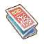 |
| 12004010 | Unknown |  |
| 12004020 | Unknown |  |
| 12004030 | Unknown |  |
| 12004040 | Unknown |  |
| 12004050 | Unknown |  |
| 12004060 | Unknown |  |
| 12004070 | Unknown |  |
| 12004080 | Unknown |  |
| 12004090 | Unknown |  |
| 12004100 | Unknown |  |
| 12004110 | Unknown |  |
| 12004120 | Unknown |  |
| 12004130 | Unknown |  |
| 12004140 | Unknown |  |
| 12004150 | Unknown |  |
| 12004160 | Unknown |  |
| 12004170 | Unknown |  |
| 12004180 | Unknown |  |
| 12004190 | Unknown |  |
| 12004200 | Unknown |  |
| 12004210 | Unknown |  |
| 12004220 | Unknown |  |
| 12004230 | Unknown |  |
| 12004240 | Unknown |  |
| 12004250 | Unknown |  |
| 12004260 | Unknown |  |
| 12004270 | Unknown |  |
| 12004280 | Unknown |  |
| 12004290 | Unknown |  |
| 12004300 | Unknown |  |
| 12004310 | Unknown |  |
| 12004320 | Unknown |  |
| 12004330 | Unknown |  |
| 12004340 | Unknown |  |
| 12004350 | Unknown |  |
| 12004360 | Unknown |  |
| 12004370 | Unknown |  |
| 12004380 | Unknown |  |
| 12004390 | Unknown |  |
| 12004400 | Unknown |  |
| 12004410 | Unknown |  |
| 12004420 | Unknown |  |
| 12004430 | Unknown |  |
| 12004440 | Unknown |  |
| 12004450 | Unknown |  |
| 12004460 | Unknown |  |
| 12004470 | Unknown |  |
| 12004480 | Unknown |  |
| 12004490 | Unknown |  |
| 12004500 | Unknown |  |
| 12004510 | Unknown |  |
| 12004520 | Unknown |  |
| 12004530 | Unknown |  |
| 12004540 | Unknown |  |
| 12004550 | Unknown |  |
| 12004560 | Unknown |  |
| 12004570 | Unknown |  |
| 12004580 | Unknown |  |
| 12004590 | Unknown |  |
| 12004600 | Unknown |  |
| 12004610 | Unknown |  |
| 12004620 | Unknown |  |
| 12004630 | Unknown |  |
| 12004640 | Unknown |  |
| 12200000 | サイリウム(ピンク) |  |
| 12200001 | サイリウム(緑) |  |
| 12200002 | サイリウム(青) |  |
| 12200010 | ほうき |  |
| 12200011 | Unknown |  |
| 12200020 | やわらくったりぬいぐるみ(モカ) |  |
| 12200021 | やわらくったりぬいぐるみ(黒) |  |
| 12200030 | 抱きぬいぐるみ・虎玉 |  |
| 12200040 | 抱きぬいぐるみ・白玉&黒玉 |  |
| 12200050 | 杖 |  |
| 12200060 | 学生かばん(黒) |  |
| 12200061 | 学生かばん(茶) |  |
| 12200070 | 両手いっぱいのひまわり |  |
| 12200080 | Unknown |  |
| 12200100 | Unknown |  |
| 12200110 | Unknown |  |
| 12200111 | Unknown |  |
| 12200112 | Unknown |  |
| 12200120 | Unknown |  |
| 12200121 | Unknown |  |
| 12200122 | Unknown |  |
| 12200130 | Unknown |  |
| 12200140 | Unknown |  |
| 12200141 | Unknown |  |
| 12200142 | Unknown |  |
| 12200150 | Unknown |  |
| 12200160 | Unknown |  |
| 12200171 | Unknown |  |
| 12200172 | Unknown |  |
| 12200173 | Unknown |  |
| 12200174 | Unknown |  |
| 12200175 | Unknown |  |
| 12200176 | Unknown |  |
| 12200180 | Unknown |  |
| 12200200 | Unknown |  |
| 12200210 | Unknown |  |
| 12200220 | Unknown |  |
| 12200221 | Unknown |  |
| 12200230 | Unknown |  |
| 12200231 | Unknown |  |
| 12200240 | Unknown |  |
| 12200250 | Unknown |  |
| 12200251 | Unknown |  |
| 12200252 | Unknown |  |
| 12200253 | Unknown |  |
| 12200254 | Unknown |  |
| 12200255 | Unknown |  |
| 12200256 | Unknown |  |
| 12200257 | Unknown |  |
| 12200258 | Unknown |  |
| 12200280 | Unknown |  |
| 12200281 | Unknown |  |
| 12200290 | Unknown |  |
| 12200300 | Unknown |  |
| 12200310 | Unknown |  |
| 12300000 | Unknown |  |
| 12300001 | Unknown |  |
| 12300010 | Unknown |  |
| 12300020 | Unknown |  |
| 12300021 | Unknown |  |
| 12300040 | Unknown |  |
| 12300041 | Unknown |  |
| 12300042 | Unknown |  |
| 12300043 | Unknown |  |
| 12300050 | Unknown |  |
| 12300051 | Unknown |  |
| 12300052 | Unknown |  |
| 14100000 | Unknown |  |
| 14100001 | Unknown |  |
| 14100002 | Unknown |  |
| 14100003 | Unknown |  |
| 14100004 | Unknown |  |
| 14100005 | Unknown |  |
| 14100006 | Unknown |  |
| 14100007 | Unknown |  |
| 14100008 | Unknown |  |
| 14100009 | Unknown |  |
| 14100010 | Unknown |  |
| 14100011 | Unknown |  |
| 14200000 | Unknown |  |
| 14200001 | Unknown |  |
| 14200002 | Unknown |  |
| 14200003 | Unknown |  |
| 14200004 | Unknown |  |
| 14200005 | Unknown |  |
| 14200006 | Unknown |  |
| 14200007 | Unknown |  |
| 14200008 | Unknown |  |
| 14200009 | Unknown |  |
| 14200010 | Unknown |  |
| 14200011 | Unknown |  |
| 14300000 | Unknown |  |
| 14300001 | Unknown |  |
| 14300002 | Unknown |  |
| 14300003 | Unknown |  |
| 20000033 | Unknown |  |
| 20000034 | Unknown |  |
| 20000035 | Unknown |  |
| 20000100 | Unknown |  |
| 20000101 | Unknown |  |
| 20000102 | Unknown |  |
| 20000103 | Unknown |  |
| 20000104 | Unknown |  |
| 20000105 | Unknown |  |
| 20000106 | Unknown |  |
| 20000107 | Unknown |  |
| 20000108 | Unknown |  |
| 20000109 | Unknown |  |
| 20000110 | Unknown |  |
| 20000111 | Unknown |  |
| 20000112 | Unknown |  |
| 20000113 | Unknown |  |
| 20000114 | Unknown |  |
| 20000115 | Unknown |  |
| 20000116 | Unknown |  |
| 20000117 | Unknown |  |
| 20000132 | 呪いのメダル 金 |  |
| 20000133 | Unknown |  |
| 20000134 | Unknown |  |
| 20000135 | Unknown |  |
| 20000137 | Unknown |  |
| 20000152 | Unknown |  |
| 20000153 | Unknown |  |
| 20000154 | Unknown |  |
| 20000155 | Unknown |  |
| 20000156 | Unknown |  |
| 20000157 | Unknown |  |
| 20000158 | Unknown |  |
| 20000166 | Unknown |  |
| 20000167 | Unknown |  |
| 20000168 | Unknown |  |
| 20000169 | Unknown |  |
| 20000170 | Unknown |  |
| 20000171 | Unknown |  |
| 20000172 | Unknown |  |
| 20000173 | Unknown |  |
| 20000174 | Unknown |  |
| 20000175 | Unknown |  |
| 20000176 | Unknown |  |
| 20000177 | Unknown |  |
| 20000185 | Unknown |  |
| 20000186 | Unknown |  |
| 20000187 | Unknown |  |
| 20000188 | Unknown |  |
| 20000189 | Unknown |  |
| 20000190 | Unknown |  |
| 20000191 | Unknown |  |
| 20000193 | Unknown |  |
| 20000198 | Unknown |  |
| 20000213 | Unknown |  |
| 20000214 | Unknown |  |
| 20000215 | Unknown |  |
| 20000216 | Unknown |  |
| 20000217 | Unknown |  |
| 20000218 | Unknown |  |
| 20000223 | Unknown |  |
| 20000229 | Unknown |  |
| 20000231 | Unknown |  |
| 20000234 | Unknown |  |
| 20000249 | Unknown |  |
| 30000000 | Unknown |  |
| 30000001 | Unknown |  |
| 30000002 | Unknown |  |
| 30000003 | Unknown |  |
| 30000004 | Unknown |  |
| 30000005 | Unknown |  |
| 30000006 | Unknown |  |
| 30000007 | Unknown |  |
| 30000008 | Unknown |  |
| 30000009 | Unknown |  |
| 30000010 | Unknown |  |
| 30000011 | Unknown |  |
| 30000012 | Unknown |  |
| 30000013 | Unknown |  |
| 30000014 | Unknown |  |
| 30000015 | Unknown |  |
| 30000016 | Unknown |  |
| 30000017 | Unknown |  |
| 30000018 | Unknown |  |
| 40100000 | Unknown |  |
| 40100010 | Unknown |  |
| 40100020 | Unknown |  |
| 40100030 | Unknown |  |
| 40100060 | Unknown |  |
| 40100070 | Unknown |  |
| 40100080 | Unknown |  |
| 40100120 | Unknown |  |
| 40100120_2 | Unknown |  |
| 40100130 | Unknown |  |
| 40100140 | Unknown |  |
| 40100150 | Unknown |  |
| 40100160 | Unknown |  |
| 40100170 | Unknown |  |
| 40100180 | Unknown |  |
| 40100190 | Unknown |  |
| 40100200 | Unknown |  |
| 40100210 | Unknown |  |
| 40100220 | Unknown |  |
| 40100230 | Unknown |  |
| 40100240 | Unknown |  |
| 40100250 | Unknown |  |
| 40100260 | Unknown |  |
| 40100270 | Unknown |  |
| 40100280 | Unknown |  |
| 40100290 | Unknown | 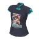 |
| 40100300 | Unknown |  |
| 40100310 | Unknown |  |
| 40100320 | Unknown |  |
| 40100330 | Unknown |  |
| 40100340 | Unknown |  |
| 40100350 | Unknown |  |
| 40100360 | Unknown |  |
| 40100370 | Unknown |  |
| 40100380 | Unknown |  |
| 40100390 | Unknown |  |
| 40100400 | Unknown |  |
| 40100410 | Unknown |  |
| 40100420 | Unknown |  |
| 40100430 | Unknown |  |
| 40100440 | Unknown |  |
| 40100450 | Unknown |  |
| 40200000 | Unknown |  |
| 40200010 | Unknown |  |
| 40200011 | Unknown |  |
| 40200020 | Unknown |  |
| 40200030 | Unknown |  |
| 40200050 | Unknown |  |
| 40200070 | Unknown |  |
| 40200070_2 | Unknown |  |
| 40200080 | Unknown |  |
| 40200090 | Unknown |  |
| 40200100 | Unknown |  |
| 40200110 | Unknown |  |
| 40300000 | Unknown |  |
| 40300010 | Unknown |  |
| 40300030 | Unknown |  |
| 40300040 | Unknown |  |
| 40400000 | Unknown |  |
| 40400010 | Unknown |  |
| 40500000 | Unknown |  |
| 40500030 | Unknown |  |
| 40500040 | Unknown |  |
| 40500060 | Unknown |  |
| 40500070 | Unknown |  |
| 40500080 | Unknown |  |
| 40500090 | Unknown |  |
| 40500100 | Unknown |  |
| 40500110 | Unknown |  |
| 40500120 | Unknown |  |
| 40500130 | Unknown |  |
| 40500140 | Unknown |  |
| 40500150 | Unknown |  |
| 40600010 | Unknown |  |
| 40600011 | Unknown |  |
| 40600020 | Unknown |  |
| 40600030 | Unknown |  |
| 40700010 | Unknown |  |
| 40700011 | Unknown |  |
| 40700020 | Unknown |  |
| 40700040 | Unknown |  |
| 40900000 | Unknown |  |
| 40900010 | Unknown |  |
| 41000000 | Unknown |  |
| 41000001 | Unknown |  |
| 41000002 | Unknown |  |
| 41000003 | Unknown |  |
| 41000100 | Unknown |  |
| 41000101 | Unknown |  |
| 41400000 | Unknown |  |
| 42200010 | Unknown |  |
| 42200020 | Unknown |  |
| 99999999 | Unknown |  |
